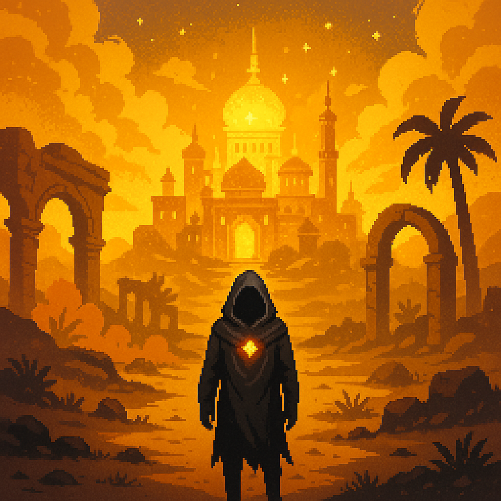

# 🎨 [The Realm]: A Color-Shattered World

Welcome to the design archive for [**The Realm**], \
a narrative-rich, hue-fractured fantasy world where emotion, memory, and magic are bound to color.

---

## 📘 Table of Contents

- [🎮 Game Design Basics](#-game-design-basics)
- [🌍 World Overview](#-world-overview)
- [📜 Timeline & History](#-timeline--history)
- [🧬 Main Character – The Prismwalker](#-main-character--the-prismwalker)
- [🧠 Personality System](#-personality-system)
- [🌀 In-Game Visual Concepts](#-in-game-visual-concepts)
- [🪄 Myths & Omens](#-myths--omens)
- [🎭 NPC Characters](#-npc-characters)
- [👹 Enemies & Monsters](#-enemies--monsters)
- [🎨 Color Codex](#-color-codex)
- [🌑 Endgame](#-endgame)
- [🗂️ File Structure & Visual Assets](#-file-structure--visual-assets)

---

## 🎮 Game Design Basics

Heavy-Lore color themed fantasy RPG Game project \
[See Game Desing Document - First Draft](./docs/gdd-draft.md)

---

## 🌍 World Overview

> “The Prism shattered. Now the hues rule alone.”

[**Read full world breakdown ›**](./docs/world.md)

<!--  -->


### Region Snapshots

<!-- <details><summary><strong>See Region Snapshots</strong></summary> -->

🟢 **Huevale** — Verdant growth & stealth puzzles  
</br>

🔴 **Vireya** — Ember-forged battlefield zone  
</br>

🔵 **Iriseld** — Floating sea-cliff archipelago  
</br>

🟣 **Myrrala** — Twilight glades of illusion  
</br>

🟡 **Luxeran** — Mirage-laced golden desert  
</br>
</br>

🤎 **Auralith** — Rusted ruins & fossil memory  
</br>

⚫ **Nullshade** — The broken, colorless core  
</br>
<!-- </details> -->

---

## 📜 Timeline & History

> “All color was once one — until we tried to own it.”

[**See full timeline ›**](./docs/timeline.md)

- 🕊️ Age of Light — Unified Core  
- 🔮 Age of Echoes — Color Orders rise  
- ⚔️ Color War & Nullshade Plague  
- 💥 The Shattering — Realms fracture  
- 🌑 The Dimming Cycle — Your era begins  

---

## 🧬 Main Character – The Prismwalker

[**Character breakdown ›**](./docs/main-character.md)

> “Born without color. Bound to none. Shaped by every hue.”


- Customizable visual
- Dialogue influenced by color
- Combat system with Huebinding & Prismatic Burst

---

## 🧠 Personality System

[**Full system ›**](./docs/personality-system.md)  
[**Mixed personality breakdown ›**](./docs/personality-system-mixed.md)

> "Your hues don't just affect your skills — they shape your voice."

<details>
<summary><strong>Examples:</strong></summary>

- 🔴 Red + 🔵 Blue = "The Calculated Flame"
- 🟢 Green + 🤎 Brown = "The Earthbound"
- 🔴 + 🟣 + 🤎 = "The Ruined Crown"
</details>

---

## 🌀 In-Game Visual Concepts

[**Full visuals ›**](./docs/in-game-visuals.md)


- Veins and aura based on hues
- Prism Core glow
- Clothing & trail effects by hue
- HUD integration suggestion

### 📷 Example Scene

[**See an in-game scene example ›**](./docs/scene-example.md)  

---

## 🪄 Myths & Omens

[**Prophecies & cryptic sayings ›**](./docs/myths-and-omens.md)

> “The first color was silence.”  
> “When the sun weeps amber, even the blind must wear masks.”

<details>
<summary><strong>Sorted by Hue</strong></summary>

- 🟢 Nature & decay  
- 🔴 Passion & war  
- 🔵 Wisdom & sorrow  
- 🟣 Magic & fate  
- 🟡 Light & illusion  
- 🤎 Death & memory  
</details>

---

## 🎭 NPC Characters

<!-- [**See npc list ›**](./docs/npcs.md) -->
[**See npc list ›**](./docs/NPCs/npcs-overview.md)

Includes:

- ✅ Character + Item ideas
- ✅ Usage in worldbuilding
- ✅ Dialogue

<details>
<summary>Example:</summary>

**Xanadu Warden**  
*Guardian of the Forgotten Gardens; poet-scout cloaked in ancient gray-green*  
**Item:** *Xanadu Stone* – Ancient mossy relic; grants visions of lost utopias when held in moonlight.
> "Gardens grow again, even over bones."\
> “This garden grew thorns when we fled.”\
> "If you listen, the moss remembers where you buried the truth."\
> “Hold the stone in moonlight — it’ll show you what we forgot.”  

**When leading the player into ancient ruins:**  
> “Roots grow around memory. Tread softly — some stones grieve.”
</details>

---

## 👹 Enemies & Monsters

[**See enemy list**](./docs/enemies/enemies.md)

---

## 🎨 Color Codex

[**See complete color/style list ›**](./docs/colors.md)

Includes:

- ✅ Hex codes
- ✅ Color symbolism

<details>
<summary>Example:</summary>

|   | Name | Hex | Description |
|---|------|-----|-------------|
|  | **Viridian** | `#40826D` | Bluish green; used in pigments and enchantment ink |
</details>


---

## 🌑 Endgame
> [!WARNING] (SPOILER!!!)

[**See what happens in the final moments (wip)](./docs/endgame.md)

---

## 🗂️ File Structure & Visual Assets

```
TODO
```

---
