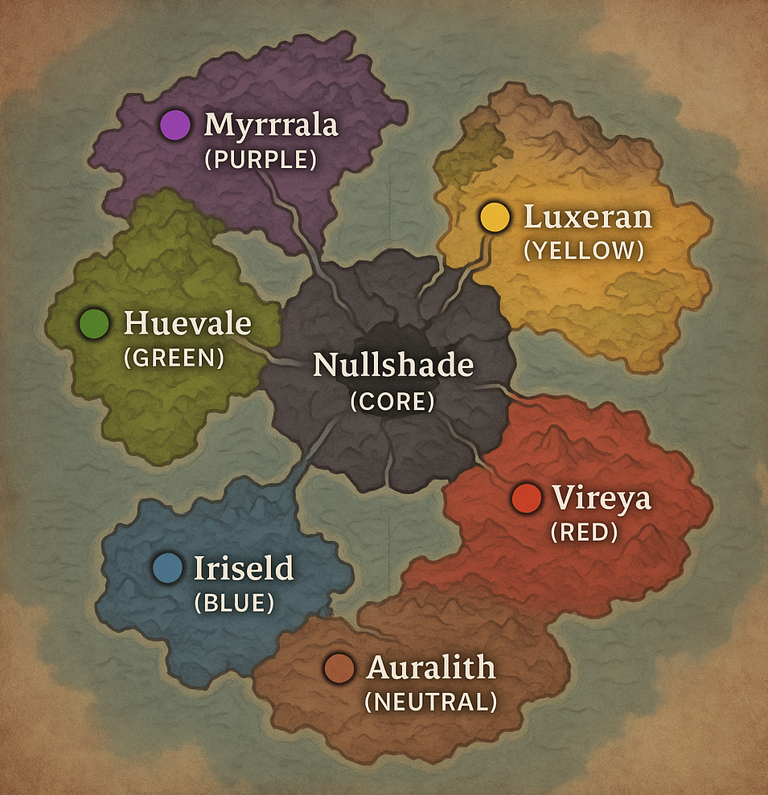
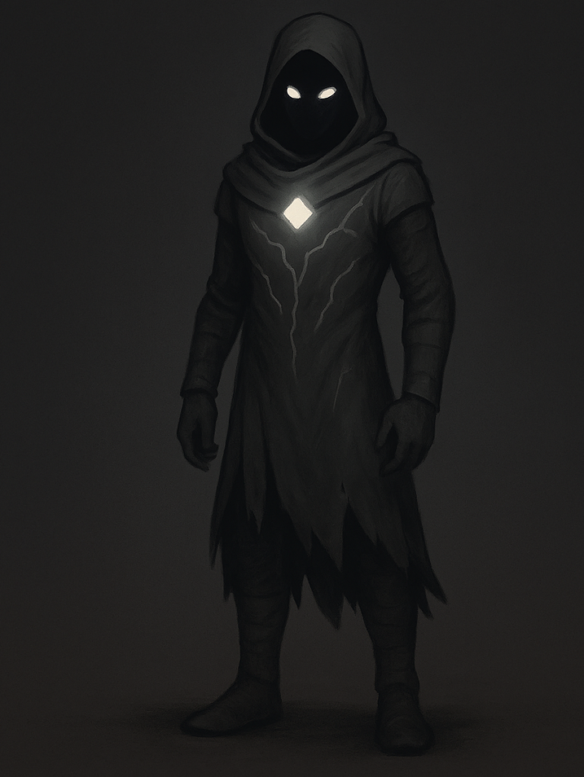
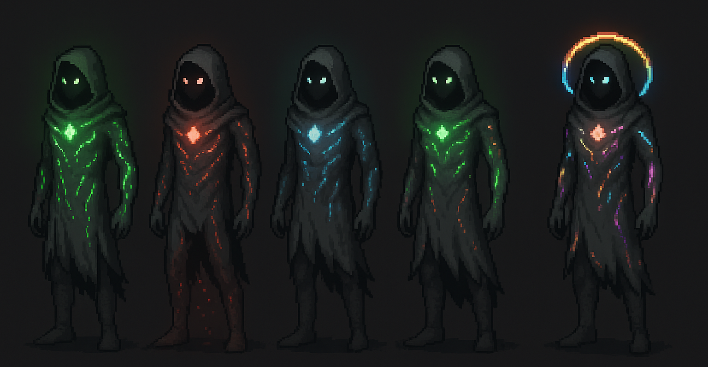

# 🎨 [The Realm]: A Color-Shattered World

Welcome to the design archive for [**The Realm**], 
a narrative-rich, hue-fractured fantasy world where emotion, memory, and magic are bound to color.

> ![NOTE]  
> [**The Realm**] is a placeholder name...

---

## 📘 Table of Contents

- [🎮 Game Design Basics](#-game-design-basics)
- [🌍 World Overview](#-world-overview)
- [📜 Timeline & History](#-timeline--history)
- [🧬 Main Character – The Prismwalker](#-main-character--the-prismwalker)
- [🧠 Personality System](#-personality-system)
- [🌀 In-Game Visual Concepts](#-in-game-visual-concepts)
  - [📷 Example Scenes](#-example-scenes)
- [🪄 Myths & Omens](#-myths--omens)
- [🎭 NPC Characters](#-npc-characters)
- [👹 Enemies & Monsters](#-enemies--monsters)
- [🎨 Color Codex](#-color-codex)
- [🌑 Endgame](#-endgame)
- [🗂️ File Structure & Visual Assets](#-file-structure--visual-assets)

---

## 🎮 Game Design Basics

Heavy-Lore color themed fantasy RPG Game project \
[See Game Desing Document - First Draft](./docs/gdd-draft.md)

---

## 🌍 World Overview

> 

<div align="center">
  <h3>[The Realm]</h3>
  
  </br><i>“The Prism shattered. Now the hues rule alone...”</i></br>

  [**Read full world breakdown ›**](./docs/world.md)

</div>

<div align="center">

|                                                 |                                  |
| ----------------------------------------------- | -------------------------------- |
| 🟢 [**Huevale**](./docs/regions/huevale.md)     | Verdant growth & stealth puzzles |
| 🔴 [**Vireya**](./docs/regions/vireya.md)       | Ember-forged battlefield zone    |
| 🔵 [**Iriseld**](./docs/regions/iriseld.md)     | Floating sea-cliff archipelago   |
| 🟣 [**Myrrala**](./docs/regions/myrrala.md)     | Twilight glades of illusion      |
| 🟡 [**Luxeran**](./docs/regions/luxeran.md)     | Mirage-laced golden desert       |
| 🤎 [**Auralith**](./docs/regions/auralith.md)   | Rusted ruins & fossil memory     |
| ⚫ [**Nullshade**](./docs/regions/nullshade.md) | The broken, colorless core       |

</div>

---

## 📜 Timeline & History

> “All color was once one — until we tried to own it.”

[**See full timeline ›**](./docs/timeline.md)

- 🕊️ Age of Light — Unified Core  
- 🔮 Age of Echoes — Color Orders rise  
- ⚔️ Color War & Nullshade Plague  
- 💥 The Shattering — Realms fracture  
- 🌑 The Dimming Cycle — Your era begins  

---

## 🧬 Main Character – The Prismwalker

<div align="center">
  <h3>The Prismwalker</h3>
  
  </br><i>“Born without color. Bound to none. Shaped by every hue.”</i></br>

  [**Character breakdown ›**](./docs/main-character.md)

</div>

### Features:
- Customizable visual
- Dialogue influenced by color
- Combat system with Huebinding & Prismatic Burst

---

## 🧠 Personality System

> "Your hues don't just affect your skills — they shape your voice."

[**See Full system ›**](./docs/personality-system.md)

### Mixed Personalities

[**See Mixed personality breakdown ›**](./docs/personality-system-mixed.md)

<details>
<summary><strong>Mixed personality examples:</strong></summary>

|                     |                        |
| ------------------- | ---------------------- |
| 🔴 Red + 🔵 Blue    | "The Calculated Flame" |
| 🟢 Green + 🤎 Brown | "The Earthbound"       |
| 🔴 + 🟣 + 🤎        | "The Ruined Crown"     |
</details>

---

## 🌀 In-Game Visual Concepts

<div align="center">
  <h3>Huebound Skin Concept</h3>
  

[**See Character Visuals Document ›**](./docs/in-game-visuals.md)

</div>

### Features:
- Veins and aura based on hues
- Prism Core glow
- Clothing & trail effects by hue
- HUD integration suggestion

### 📷 Example Scenes

[**See in-game scene examples ›**](./docs/scenes/scene-examples.md)  

---

## 🪄 Myths & Omens

> “The first color was silence.”  
> “When the sun weeps amber, even the blind must wear masks.”

[**See More Prophecies & cryptic sayings ›**](./docs/myths-and-omens.md)

<!-- <details><summary><strong>Sorted by Hue</strong></summary>

- 🟢 Nature & decay  
- 🔴 Passion & war  
- 🔵 Wisdom & sorrow  
- 🟣 Magic & fate  
- 🟡 Light & illusion  
- 🤎 Death & memory  
</details> -->

---

## 🎭 NPC Characters

> (W.I.P.)

[**See npc list ›**](./docs/NPCs/npcs-overview.md)

Includes:

- Character + Item ideas
- Usage in worldbuilding
- Dialogue

<details>
<summary>Example:</summary>

**Xanadu Warden**  
*Guardian of the Forgotten Gardens; poet-scout cloaked in ancient gray-green*  
**Item:** *Xanadu Stone* – Ancient mossy relic; grants visions of lost utopias when held in moonlight.
> "Gardens grow again, even over bones."\
> “This garden grew thorns when we fled.”\
> "If you listen, the moss remembers where you buried the truth."\
> “Hold the stone in moonlight — it’ll show you what we forgot.”  

**When leading the player into ancient ruins:**  
> “Roots grow around memory. Tread softly — some stones grieve.”
</details>

---

## 👹 Enemies & Monsters

[**See enemy list**](./docs/enemies/enemies.md)

---

## 🎨 Color Codex

[**See complete color/style list ›**](./docs/colors.md)

Includes:

- ✅ Hex codes
- ✅ Color symbolism

<details>
<summary>Example:</summary>

|   | Name | Hex | Description |
|---|------|-----|-------------|
|  | **Viridian** | `#40826D` | Bluish green; used in pigments and enchantment ink |
</details>


---

## 🌑 Endgame
> [!WARNING] (SPOILER!!!)

[**See what happens in the final moments (wip)](./docs/scenes/endgame.md)

---

## 🗂️ File Structure & Visual Assets

```
TODO
```

---
