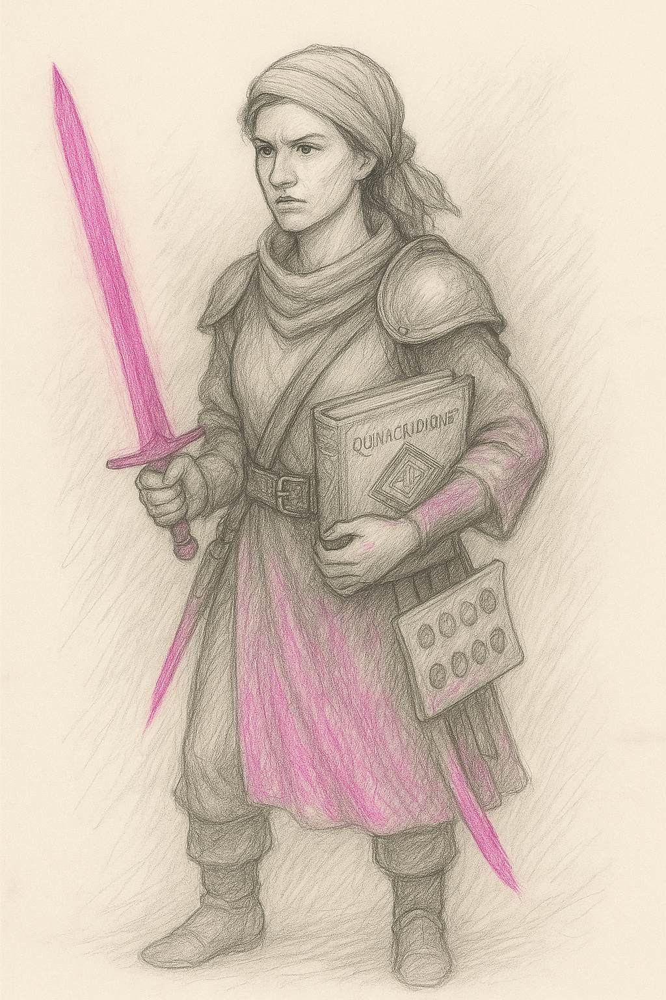

> (WIP)

# 🎭 NPC Characters by Color Archetype

List of some "main" NPC characters with:
- Their name/title
- Description
- Key item
- Dialogue

> The dialogue lines can be used in dialogue, carvings, memory echoes, or journal fragments.\
> Each reflects the character’s personality, domain, or worldview.

---

<b>🟢 Huevale - Nature, growth, alchemy, stealth</b>

  <h3>Xanadu Warden</h3>
  <i>Guardian of the Forgotten Gardens</i> 
  
   <i>Poet-scout cloaked in ancient gray-green</i>  

> "Gardens grow again, even over bones."  
> “This garden grew thorns when we fled.” 
> "If you listen, the moss remembers where you buried the truth."  
> “Hold the stone in moonlight — it’ll show you what we forgot.” 

**When leading the player into ancient ruins:**  
> “Roots grow around memory. Tread softly — some stones grieve.”

**Item:** *Xanadu Stone* – Ancient mossy relic; grants visions of lost utopias when held in moonlight.

<!-- - [Philodendron Xanadu](https://en.wikipedia.org/wiki/Thaumatophyllum_xanadu) -->

---

  <h3>Viridian Alchemist</h3>
  <i>Master of stable transmutations; uses sacred bluish-green ink to draw power into pigments</i> 
  
   <i>Alchemical scribe clad in bluish-green robes</i>  

> "Balance is pigment and patience."  
> "When the ink runs dry, the spell is complete."  
> “A drop of this will make a promise eternal — or a lie irreversible.” 
> “Some colors need silence to set.” 

**When offering a spell recipe:**  
> “Write it with care. Ink has memory… and moods.”

**Item:** *Viridian Ink* – Alchemical dye that makes enchanted glyphs permanent and immune to dispelling.

---

  <h3>Feldgrau Veteran</h3>
  <i>Retired soldier turned mercenary strategist; armor camouflaged like mossy stone</i> 
  
   <i>Weathered tactician with forest-blended armor</i>  

> "Cover the blade in green, and the blood won't shine."  
> "I've seen ghosts lose their war... and still stand guard."  
> “I buried more comrades than I remember. But moss remembers them all.” 
> “Don’t ask about my medals. Ask the forest where I left them.” 

**When asked to teach strategy:**  
> “Plan like the forest — layered, patient, and ready to swallow noise.”

**Item:** *Feldgrau Cloak* – Worn by ghost soldiers; renders the wearer near-invisible in forests or ruins.

---

  <h3>Skobeloff Diver</h3>
  <i>Underwater relic hunter from the deep teal cities; agile and silent</i> 
  
   <i>Silent salvager in shimmering teal armor</i>  

> "Below the blue, there’s only pressure and memory."  
> "The deeper you dive, the older the lies become."  
> “Light lies. Pressure doesn’t.” 
> “This lens? It’s seen ghosts smile at their traps.” 

**When spotting a hidden artifact:**  
> “There. It blinks when your heart does. Don’t ask how I know.”

**Item:** *Skobeloff Lens* – A monocle that sees through illusion and detects magical traps in dim light.

---

  <h3>Chartreuse Initiate</h3>
  <i>Monk of the Carthusian order; channels light and laughter through herbal potions</i> 
  
   <i>Herbal monk glowing with green glee</i>  

> "Joy ferments like herbs — bitter, then healing."  
> "Laugh, and the gods might laugh with you. Or at you."  
> “Drink with intent. Laugh with abandon. Regret with wisdom.” 
> “The gods cackle. Why shouldn’t we?” 

**When giving the player a potion:**  
> “Side effects may include euphoria, clarity… and bears.”

**Item:** *Chartreuse Tonic* – Electric-green potion brewed by monks; restores stamina and induces laughter.

---

  <h3>Malachite Oracle</h3>
  <i>Green-seer of ancient ruins; speaks in cryptic prophecy while wrapped in stone-green robes</i> 
  
  
   <i>Stone-veiled prophet whispering mossy truths</i>  

> "When the stone speaks, silence obeys."  
> "Change is the only truth the roots trust."  
> “Fate is a serpent. I only provide the fang.” 
> “I don’t speak prophecy. I just repeat what the moss sings.” 

**When asked for a vision:**  
> “Bring me something forgotten. Only then can I show you what’s ahead.”

**Item:** *Malachite Fang* – Serpent-blade of verdant ore; poisons foes with dreams of transformation.

---

  <h3>Smaragdine Knight</h3>
  <i>Emerald-armored protector of forest realms; blade glints like gem-cut leaves</i> 
  
   <i>Warden of groves, armored in emerald brilliance</i>  

> "Armor grown, not forged, binds better to purpose."  
> "Even the emerald bleeds green in war."  
> “The vine crowned me, not kings.” 
> “If my blade shakes, it’s because the forest weeps with me.” 

**When rallying before a fight:**  
> “Stand with the grove. Bend if you must, but do not fall.”

**Item:** *Smaragdine Circlet* – Crown of living vine and emerald; boosts nature magic and calms beasts.

---

  <h3>Celadon Archivist</h3>
  <i>Ethereal scholar tending to pottery libraries; memory sealed in glazed runes</i> 
  
   <i>Librarian of porcelain echoes</i>  

> "Each glaze holds a lifetime. Crack it, and you hear the end."  
> "Nothing fades — only layers build."  
> “Don’t drop that shard. It remembers your secrets faster than you forget them.” 
> “Porcelain has better memory than flesh.” 

**When asked about a forgotten incantation:**  
> “Check the seventh shelf. No, not that one. The one that hums when you lie.”

**Item:** *Celadon Shards* – Pieces of enchanted porcelain; used to record spells visually like film.

---

  <h3>Limerick Druid</h3>
  <i>Trickster of the glens; chants in verse to charm beasts and brew illusions</i> 
  
  
   <i>Rhyming rogue cloaked in bog-oak and mischief</i>  

> "Rhyme binds more than rope. Ask the fox."  
> "When the wind sings your name backward, don’t answer."

**Item:** *Limerick Flute* – Woodwind carved from bog-oak; playing it conjures playful forest spirits.

> [!NOTE]
> (Maybe he could only speak in limericks ?)

See <i>Limerick Druid's dialogue in limericks</i>

#### 🌿 **Limerick Druid – Dialogue in Limericks**

**Upon First Meeting:**
> In the glen where the foxes all play,\
> I wandered and rhymed through the day.\
> If you follow the tune,\
> Don’t look at the moon —\
> It’s watching and wanders away.

**Offering Advice:**
> When vines block your path, don’t be mad —\
> They’re grumpy, not wicked or bad.\
> Just whisper a song,\
> Not too short or too long,\
> And they'll move — if they’re feeling unclad.

**On the Nature of Illusions:**
> An echo can dance like a deer,\
> And giggle a foot from your ear.\
> If the trees start to hum,\
> You should probably run —\
> Or you’ll marry a mushroom, I fear.

**When Using His Flute:**
> A note from this flute in my hand,\
> Can summon a trickster or band.\
> One puff and they leap,\
> Out of root, bark, or deep —\
> Though they rarely obey what I planned.

**If the Player Asks About the Prismwalker:**
> You’re colorless now — quite a feat!\
> A vessel both blank and complete.\
> Will you bloom or decay?\
> Well, either way…\
> The moss at your feet thinks you’re neat.

**On the Forest Responding to Magic:**
> The forest remembers each tread,\
> And whispers your dreams when you’ve fled.\
> But step with intent,\
> And you may just prevent\
> What the vines had been planning instead.

---

  <h3>Harlequin Trickblade</h3>
  <i>Masked jester-assassin; strikes with chaotic glee in carnival-green attire</i> 
  
   <i>Chaos-laced killer in motley mirth</i>  

> "Chaos is the only pattern sharp enough to cut fate."  
> "I laugh when death forgets its cue."  
> “Every stab’s a joke with a punchline in blood.” 
> “Catch me? You’re already part of the act.” 

**When disappearing mid-battle:**  
> “Guess who? Wrong answer!”

**Item:** *Harlequin Mask* – Jester’s enchanted visage; wearer can mimic any voice and dodge fate once per day.

---

  <h3>Saproot Cultist</h3>
  <i>Swamp-dweller devoted to a sleeping tree god; channels earthy green ichor</i> 
  
   <i>Dripping acolyte of the dreaming bark</i>  

> "The god sleeps in bark — dream too loud and it might wake."  
> "Rot is just birth with teeth."  
> “I bleed sap, not doubt.” 
> “Decay’s not death. It’s the soil praying.” 

**When defending their faith:**  
> “Worship the rot. It’s the only thing that listens forever.”

**Item:** *Saproot Idol* – Carved from swamp wood and berries; protects its owner from decay and curses.

---

  <h3>Thalera the Rootborn</h3>
  <i>Verdant Ghost formed from roots and vines</i> 
  
   <i>Translucent figure with green-glowing antlers</i>  

> “Your feet are bare. Your breath uncolored.  
> You do not belong, Prismwalker.” 
>   
> “Yet… you carry the Root’s grief in your steps.”

[**See Verdant Ghost in Example Scene**](../scenes/scene-greenwood.md#npc-encounter)  

<!-- - [Thalera Moth](https://en.wikipedia.org/wiki/Thalera) -->

---

<b>🔴 Vireya — Passion, war, sacrifice, rebellion</b>

  <h3>Amaranth The Undying</h3>
  <i>Immortal martyr of the Crimson Bloom; rebirth marked by the flower's hue</i> 
  
   <i>Wounded saint whose blood births blossoms</i>  

> "Rebirth is a mercy. I’ve done it too many times."  
> "The bloom is beautiful... just before it drinks."  
> “My death matters more than my life. That’s why I keep dying.” 
> “This isn’t immortality. It’s a long apology.” 

**When recruiting the player into battle:**  
> “Fight beside me, and if we fall… the bloom remembers us both.”

**Item:** *Amaranth Rose* – Crimson flower preserved in crystal; heals mortal wounds but shortens life span.

---

  <h3>Vermilion Duelist</h3>
  <i>Champion of the Blood Arena; blade dances like firelight on lacquered red armor</i> 
  
   <i>Blademaster veiled in fire and fury</i>  

> "Only blood can sign a name in fire."  
> "A blade’s purpose is to be answered."  
> “Cut hesitation first. Then the enemy.” 
> “Every duel is a question. My blade is the answer.” 

**Before a duel begins:**  
> “No second cuts. Speak through your steel.”

**Item:** *Vermilion Brand* – A tattooed sigil applied by fire; grants war fury and immunity to heat.

---

  <h3>Nacarat the Fox</h3>
  <i>Desert thief with a fiery coat; vanishes like a mirage at dusk</i> 
  
   <i>Sly shadow with sand beneath her tongue</i>  

> "The desert buries liars quickly. And cleanly."  
> "Mirages don’t lie — they just let you dream wrong."  
> “Want truth? Catch a fox. Want lies? Catch your shadow.” 
> “I never vanish — I just slip into stories.” 

**When slipping the player a stolen key:**  
> “Don’t thank me. Just don’t get caught — I’m allergic to gratitude.”

**Item:** *Nacarat Ember* – Glowing coal carried in a fox-skin pouch; ignites at a whisper, burns without fuel.

---

  <h3>Falu Homesteader</h3>
  <i>Stubborn defender of the Red Timber Towns; wields copper tools as weapons</i> 
  
   <i>Grizzled builder whose hammer sings defense</i>  

> "If the hearth dies, so do the hills."  
> "Redwood walls don't fall... they remember why they stand."  
> “Call me stubborn one more time. I’ll outlive the insult.” 
> “This hammer built hope. And broke bones.” 

**When asked about leaving town:**  
> “This land raised me. I won’t leave until it dies. And maybe not then.”

**Item:** *Falu Charm* – House-shaped pendant from red timber; wards off undead and snow spirits.

---

  <h3>Alizarin, the Crimson Weaver</h3>
  <i>Sorceress who stitches fate through dyed threads; prefers madder-red robes</i> 
  
   <i>Seamstress of sacrifice and scarlet oaths</i>  

> "Threads bind what memory cannot."  
> "I sew fate. Careful what color you bleed."  
> “Want to know if you’re brave? Touch a red square.” 
> “Even death has patterns. I just embroider them.” 

**When gifting a square of her quilt:**  
> “This one’s blank. Fill it with something worth mourning.”

**Item:** *Alizarin Quilt* – A patchwork battle banner; each square records a heroic death, grants courage.

---

  <h3>Cinnabar Mask</h3>
  <i>Masked envoy of joy and death; rituals painted in sacred red-orange</i> 
  
   <i>Ceremonial trickster cloaked in rite and riddle</i>  

> "Smiles are masks. Mine just fits better."  
> "A ritual is only wrong if no one claps."  
> “I’ve danced at ten funerals. And nine weddings. I forget which was louder.” 
> “Blood is just ink for a louder story.” 

**When performing a rite in the field:**  
> “Clap, or it gets awkward. The spirits hate awkward.”

**Item:** *Cinnabar Seal* – Enchanted wax stamp; bonds contracts with joyful truth or cruel irony.

---

  <h3>Coquelicot Banner</h3>
  <i>Symbol of resistance; a vivid poppy standard carried by forgotten heroes</i> 
  
   <i>Marching memory sewn into a fluttering flame</i>  

> "Poppies bloom where martyrs fall."  
> "Raise a flag, bury a name. It’s the same gesture."  
> “When the wind lifts the banner, it remembers who held it.” 
> “No grave marks me. The flowers do.” 

**When giving the brooch to the player:**  
> “This doesn’t make you a hero. It makes you the next.”

**Item:** *Coquelicot Brooch* – Worn by war widows; summons a field of ghostly poppies once per year.

---

<b>🔵 Iriseld — Wisdom, storms, sorrow, mystery</b>

  <h3>Zaffre Glasswright</h3>
  <i>Artisan who speaks through cobalt glass; traps memories in shimmering windows</i> 
  
   <i>Silent artisan with cobalt-stained fingers</i>  

> "Glass keeps what words forget."  
> "Look too deep, and you’ll find what looked back."  
> "This vial doesn’t show you what’s hidden — it shows you what you buried."  
> "I don’t make windows. I make confessions."  

**When using the vial to unlock a memory gate:**  
> “Step through. Just don’t expect the same person to come out.”

**Item:** *Zaffre Vial* – Cobalt bottle filled with enchanted tears; reveals hidden doors or passages.

---

  <h3>Glaucous Wing</h3>
  <i>Avian shapeshifter who guards the misty cliffs; feathers mimic sea-gray skies</i> 
  
  
   <i>Mist-cloaked guardian with wind-slicked feathers</i>  

> "Wings are for silence, not escape."  
> "The sky mourns every fall — listen."  
> "Storms nest in my ribs. I just let them breathe."  
> "Feathers are liars. The wind is honest."  

**When offering a lift to high cliffs:**  
> “Hold tight. The clouds bite when you hesitate.”

**Item:** *Glaucous Feather* – From a sky-serpent; lets the bearer hover silently or speak with birds.

---

  <h3>Cerulean Skydancer</h3>
  <i>Messenger of wind spirits; performs aerial rites in azure silks</i> 
  
   <i>Azure-robed wind priest of the upper airstreams</i>  

> "You rise only when you fall with grace."  
> "The wind doesn’t forget who defies it."  
> "Each gust speaks a different name. Most are warnings."  
> "Flight is a promise — not to fall, but to keep dancing."  

**Before a sky-ritual sequence:**  
> “Move like lightning forgot your name.”

**Item:** *Cerulean Cloak* – Azure silk garment; wearer is immune to lightning while in open skies.

---

  <h3>Eigengrau the Unseeing</h3>
  <i>Shadowmancer from the realm of whispers; commands darkness of the mind’s eye</i> 
  
  
   <i>Blindfolded oracle veiled in dream-darkness</i>  

> "Not all shadows are cast by light."  
> "The color you see in dreams is me."  
> "I blind myself to see deeper. You still blink too much."  
> "Fear isn’t a wall. It’s a mirror with dust on it."  

**When the player hesitates to look into the prism:**  
> “You won’t like what you see. That’s why it’s worth looking.”

**Item:** *Eigengrau Prism* – Dark crystal; shows the user's subconscious desires or fears when gazed into.

---

  <h3>Payne’s Shade</h3>
  <i>Painter of illusions and forger of souls; dreams in blue-gray landscapes</i> 
  
   <i>Somber artist in tattered smocks of storm-hue</i>  

> "Illusion needs a frame... and a witness."  
> "Every masterpiece begins in gray."  
> "What you see isn’t false — it’s just unfinished."  
> "I’ve painted gods, liars, and myself. Only the canvas knows who’s real."  

**While casting a large-scale illusion:**  
> “The world is easier to fix when you paint over it first.”

**Item:** *Payne’s Brush* – Artist’s brush made from shadow-hair; paints illusions that persist for an hour.

---

<b>🟣 Myrrala — Magic, dreams, fate, illusion</b>

  <h3>Wisteria Enchantress</h3>
  <i>Soft-spoken spellcaster from the vine-covered tower; weaves gentle glamours</i> 
  
  
   <i>Glamour-witch robed in dusk and perfume</i>  

> "Charm is a quieter curse."  
> "I weave kindness like silk — hard to notice until you're bound."  
> "Glamour is truth made beautiful enough to forgive."  
> "If the moon nods at you — don’t blink."  

**When encountered during twilight hours:**  
> “The light’s soft now. It listens better than it speaks.”

**Item:** *Wisteria Veil* – Shimmering shawl; obscures the wearer’s presence in twilight and dreams.

---

  <h3>Periwinkle Siren</h3>
  <i>Melodic sea-fae; lures sailors with shimmering, lavender-toned scales</i> 
  
  
   <i>Lavender-scaled fae with a haunting voice</i>  

> "Not all drowning starts with water."  
> "My voice is a mirror. What did you say?"  
> "Most sailors drown before they notice."  
> "Sing back — if you remember the tune."  

**If you resist her magic:**  
> “Mmm… A strong mind. I wonder who last owned it.”

**Item:** *Periwinkle Pearl* – Held by sea witches; grants underwater breathing and mild hypnosis powers.

<!-- Pervenche Periwinkle -->

---

  <h3>Mauveine Spark</h3>
  <i>Chemist of chaotic color; experiments with first-gen synthetic magic-dyes made with coal tar</i> 
  
   <i>Color-alchemist in stained gloves and goggles</i>  

> "Chaos doesn’t knock. It bursts into color."  
> "Mix coal and genius, and pray you’re not flammable."  
> "Science is just madness with a recipe."  
> "I brew brilliance. Accidents are a side effect."  

**Before handing you a volatile concoction:**  
> “It might explode. But beautifully.”

**Item:** *Mauveine Flask* – Contains the first artificial magic dye; causes chaotic effects with every sip.

---

  <h3>Heliotrope Devotee</h3>
  <i>Solar cleric whose power waxes as the flower turns; harbors eternal love</i> 
  
   <i>Sun-marked devotee with flowered circlet</i>  

> "The sun doesn't follow the flower. It's the other way 'round."  
> "Devotion is light that blinds from behind."  
> "I loved once. Now I just orbit."  
> "The light that saves also sears."  

**During sunrise rites:**  
> “Watch the petals. They know before we do.”

**Item:** *Heliotrope Band* – Bracelet that glows with solar devotion; protects from dark curses at dawn.

---

  <h3>Razzmatazz Sprite</h3>
  <i>Tiny fey of mischief and parties; bursts into pink when laughing</i> 
  
   <i>Flickering pixie-trickster with a booming laugh</i>  

> "Fun is dangerous when it’s your only defense."  
> "If it giggles in the dark... it’s probably me."  
> "I drummed a mountain awake once. It danced."  
> "Magic’s more fun when it’s not yours."  

**When helping unlock a sealed relic:**  
> “Boom or bloom? Depends if I’m bored.”

**Item:** *Razzmatazz Drum* – A fey instrument; awakens slumbering magic in artifacts when played.

---

  <h3>Fandango Duelstar</h3>
  <i>Performer-warrior of the Passion Stage; dances and duels with equal flair</i> 
  
   <i>Dueling performer cloaked in sequined pink</i>  

> "A dance is just a duel without grief."  
> "If they watch you bleed, make it beautiful."  
> "My blade flirts. My steps kill."  
> "The crowd never applauds silence."  

**Before a staged combat sequence:**  
> “Shall we waltz in wounds?”

**Item:** *Fandango Dagger* – Curved pink-steel blade; glows during duels and sings when blood is spilled.

---

  <h3>Thulian Emissary</h3>
  <i>Ambassador from a hidden mineral kingdom; eyes shimmer pink and knowing</i> 
  
  
   <i>Gem-veined diplomat draped in echoing robes</i>  

> "Truth is a rare gem. Most aren’t polished enough to see it."  
> "I don’t lie. I just leave out the easy parts."  
> "Reflections are fragments. So are we."  
> "This mirror shows your truth, not mine."  

**When the player questions their motives:**  
> “Does a prism pick its angles?”

**Item:** *Thulian Mirror* – Polished rare stone; shows only truth, but not always the full picture.

---

  <h3>Pomp & Power Chancellor</h3>
  <i>Royal advisor cloaked in purple splendor; speaks softly, commands much</i> 
  
   <i>Opulent figure with velvet rings and quiet power</i>  

> "Control wears robes, not armor."  
> "Kings bow to the voice behind the curtain."  
> "I whisper loud enough to dethrone."  
> "Power isn’t taken — it’s worn well."  

**When advising you in court intrigue:**  
> “Smile. Then command. In that order.”

**Item:** *Pomp and Power Mantle* – Opulent royal cape; grants temporary command over nobles and weak-willed minds.

---

  <h3>Liseran Caretaker</h3>
  <i>Matron of the Blooming Shrine; protector of rebirth and mothers</i> 
  
   <i>Grieving guardian with violet-lily cloak</i>  

> "Rebirth always costs something — even if it’s love."  
> "Lilies bloom in mourning, not celebration."  
> "I tend grief like a garden — quietly."  
> "Each birth echoes a loss unspoken."  

**When helping restore a fading memory:**  
> “Let the petals carry what you can’t.”

**Item:** *Liseran Lily* – Frail blossom encased in mana crystal; releases a healing aura upon breaking.

---

  <h3>Quinacridone Blade</h3>
  <i>Warrior-painter whose magenta blades never dull; fights for aesthetic justice</i> 
  
   <i>Vivid warrior splashed with paint and blood</i>  

> "Style without edge is decoration."  
> "Every duel writes a stroke in my masterpiece."  
> "Blood is pigment. Pain is brushwork."  
> "I duel to compose beauty — not to win."  

**During combat in radiant fields:**  
> “Strike like a stanza. Parry like a rhyme.”

**Item:** *Quinacridone Codex* – A grimoire of vibrant pigments; its spells must be painted mid-battle.

---

<b>🟡 Luxeran — Sunlight, trickery, vitality, illusion</b>

  <h3>Gamboge Monk</h3>
  <i>Varnish-wearing martial artist from lacquered temples; calm but deadly</i> 
  
   <i>Golden-clad warrior of silent strikes</i>  

> "Lacquer what you can’t clean."  
> "Even peace bruises when it lands too hard."  
> "Silence can hit harder than thunder — if you wait long enough."  
> "I meditate between footsteps."  

**When ambushed unexpectedly:**  
> "Violence without grace? That’s just noise."

**Item:** *Gamboge Gourd* – Lacquered container used in rituals; once uncorked, releases holy smoke.

---

  <h3>Eburnean Priestess</h3>
  <i>Ivory-clad oracle who reads the cracks in bone and tusk</i> 
  
  
   <i>Seeress in white bone and quiet futures</i>  

> "Ivory cracks from pressure, not time."  
> "A roll of the dice echoes louder than a prayer."  
> "I don’t predict fate. I flirt with it."  
> "The bones say you’re lucky — or very stubborn."  

**When asked for a prophecy:**  
> "Close your eyes. If you see something... that’s mine."

**Item:** *Eburnean Dice* – Carved from ivory tusk; used to gamble for fate—win or lose a memory.

---

  <h3>Citrine Artisan</h3>
  <i>Jeweler whose pieces brighten spirits; her work promotes joy and prosperity</i> 
  
   <i>Bright-eyed gemsmith with golden tools</i>  

> "Jewels are emotions you can wear."  
> "Happiness is the easiest lie to sell."  
> "What shines isn’t always treasure — sometimes it’s just a clever angle."  
> "Gold doesn’t cheer you up. But it listens better than people."  

**When offering to sell something:**  
> "This one sparkles just right when you lie."

**Item:** *Citrine Lens* – Yellow gemstone monocle; lets wearer see sources of happiness or greed.

---

  <h3>Aureolin Flame</h3>
  <i>Pyromancer of radiant power; spells as blinding as her robes</i> 
  
   <i>Golden-robed pyromancer with flaming ink</i>  

> "Light writes in searing ink."  
> "The sun favors the daring — until it burns them."  
> "Speak boldly — or I’ll light the silence myself."  
> "The truth glows hottest when denied."  

**Before casting a judgment spell:**  
> "I’ll sign this in flame. Hope you brought sunglasses."

**Item:** *Aureolin Quill* – Golden feather pen; makes any signature legally and magically binding.

---

  <h3>Orangepeel Courier</h3>
  <i>High-speed runner of the trade roads; scent of citrus marks her trail</i> 
  
   <i>Fleet-footed courier with citrus charms</i>  

> "Speed is safety. Talk later."  
> "The scent hits before the shadow does."  
> "Trade waits for no one — except me."  
> "If the deal smells off, I already ran."  

**When delivering crucial intel:**  
> "Fast news. Fresh squeeze. Take it or leave it."

**Item:** *Orange Peel Charm* – Zesty amulet; worn by traders, it wards off fatigue and attracts good deals.

---

  <h3>Fulvous Hunter</h3>
  <i>Camouflaged ranger of drylands; wears the fur-toned cloak of predators</i> 
  
   <i>Silent tracker cloaked in desert tones</i>  

> "Dust whispers louder than prey."  
> "Your shadow’s too loud. I’ll take care of it."  
> "The desert doesn’t hide — it just forgets quickly."  
> "Don’t blink. That’s when they move."  

**While stalking a dangerous target:**  
> "This sand remembers feet. Yours, especially."

**Item:** *Fulvous Hide* – Fur cloak from desert beasts; grants advantage when tracking or hiding in sand.

---

<b>🤠Auralith — Memory, decay, silence, alchemy</b>

  <h3>Isabelline Widow</h3>
  <i>Wanderer in sun-bleached clothes; said to never wash until vengeance is served</i> 
  
  
   <i>Grieving nomad wrapped in dusty resolve</i>  

> "Wash your grief, and you’ll lose its weight."  
> "Dust tells stories the living forget."  
> "The tapestry knows betrayal before I do."  
> "I haven’t cleaned these robes. I still wear his silence."  

**When sensing betrayal nearby:**  
> "The threads are trembling. Someone here has false hands."

**Item:** *Isabelline Tapestry* – Ancient woven scene; changes to warn of betrayal or deceit near the viewer.

---

  <h3>Burnt Sienna Sculptor</h3>
  <i>Carves stories into ochre stone; each statue whispers with ancestral memory</i> 
  
   <i>Stonecarver with clay-stained hands</i>  

> "Stone remembers better than blood."  
> "Each chip is a truth I don’t speak."  
> "The louder you strike, the less the stone trusts you."  
> "My statues don’t lie. They just need dust to wake."  

**When animating a statue:**  
> "Stand back. The old soul still has questions."

**Item:** *Burnt Sienna Golem Core* – Heart of an old earthen automaton; can animate one statue per moon cycle.

---

  <h3>Bistre Archivist</h3>
  <i>Caretaker of soot-stained scrolls; lorekeeper with smudged hands and perfect recall</i> 
  
   <i>Shadow-eyed scholar with ash-covered fingers</i>  

> "Soot smears, but it preserves."  
> "Ink lies. Burnt pages confess."  
> "I remember everything. Especially the lies we burned."  
> "Ask the flame — it reads better than I do."  

**When revealing a hidden memory:**  
> "Watch the wall. Shadows keep clearer records than kings."

**Item:** *Bistre Lantern* – Sooty lamp that reveals past events in shadows when lit in forgotten places.

---

  <h3>Mikado Warlord</h3>
  <i>Regal tyrant in lacquered armor; his rule polished, his justice sharp</i> 
  
   <i>Disciplined warrior draped in golden lacquer</i>  

> "Style is strength with discipline."  
> "A cut made with grace leaves a cleaner wound."  
> "The blade teaches faster than books."  
> "Balance. Posture. And one clean decision."  

**Before executing judgment:**  
> "Rust never dulled this edge. Only hesitation does."

**Item:** *Mikado Katana* – Heirloom blade lacquered in gold-brown; grants calm focus and unerring strikes.

---

  <h3>Caput Mortuum Ascetic</h3>
  <i>Alchemist of decay and transmutation; wears the color of dried blood and rust</i> 
  
   <i>Rust-robed philosopher with deathless eyes</i>  

> "Death isn’t the end — it’s the element most resist."  
> "Let rot teach you what gold never will."  
> "I studied endings until they started talking back."  
> "What decays can be distilled."  

**When offering alchemical aid:**  
> "It won’t taste like hope. But it’ll buy you time."

**Item:** *Caput Mortuum Phylactery* – Dusty alchemical relic; binds part of one’s soul to forestall death by years.

---

<b>Void/Gray/Multicolor/Unaligned entities</b>

### Void/Gray/Multicolor/Unaligned entities (?)

---
