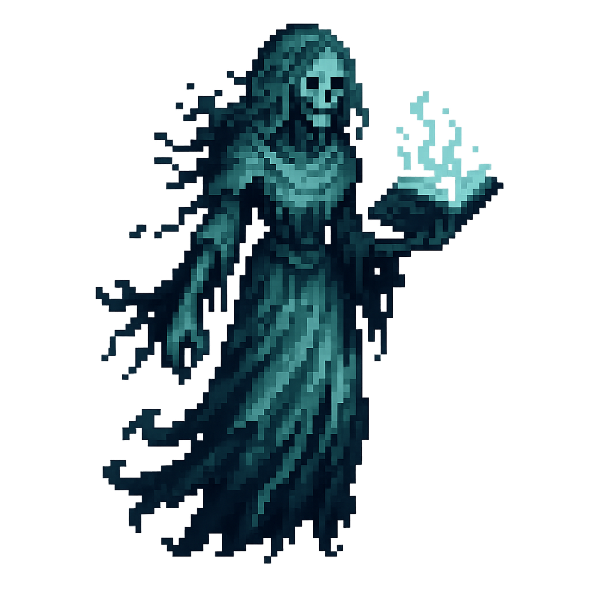
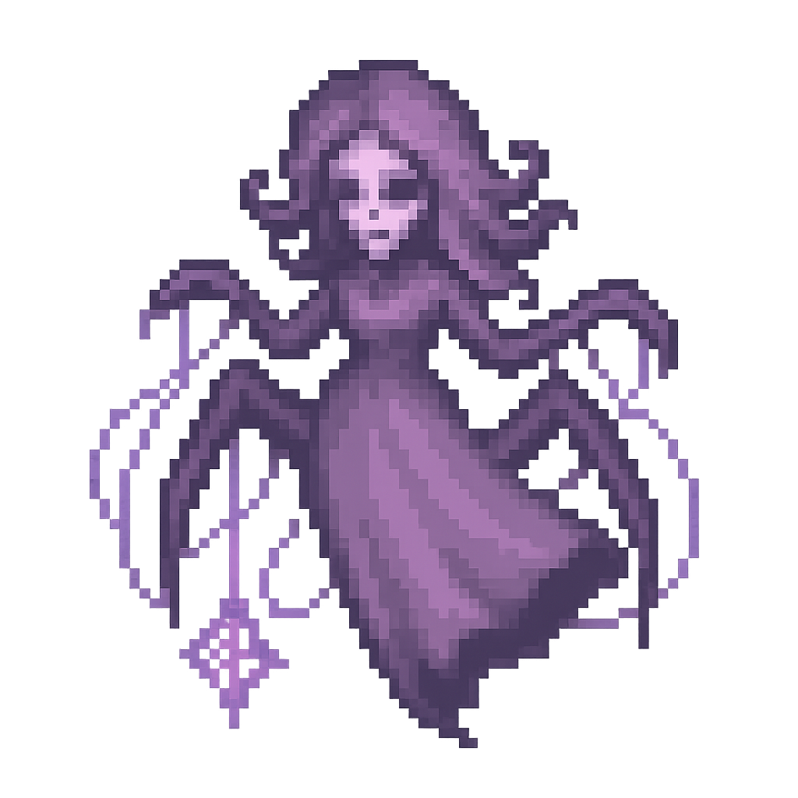
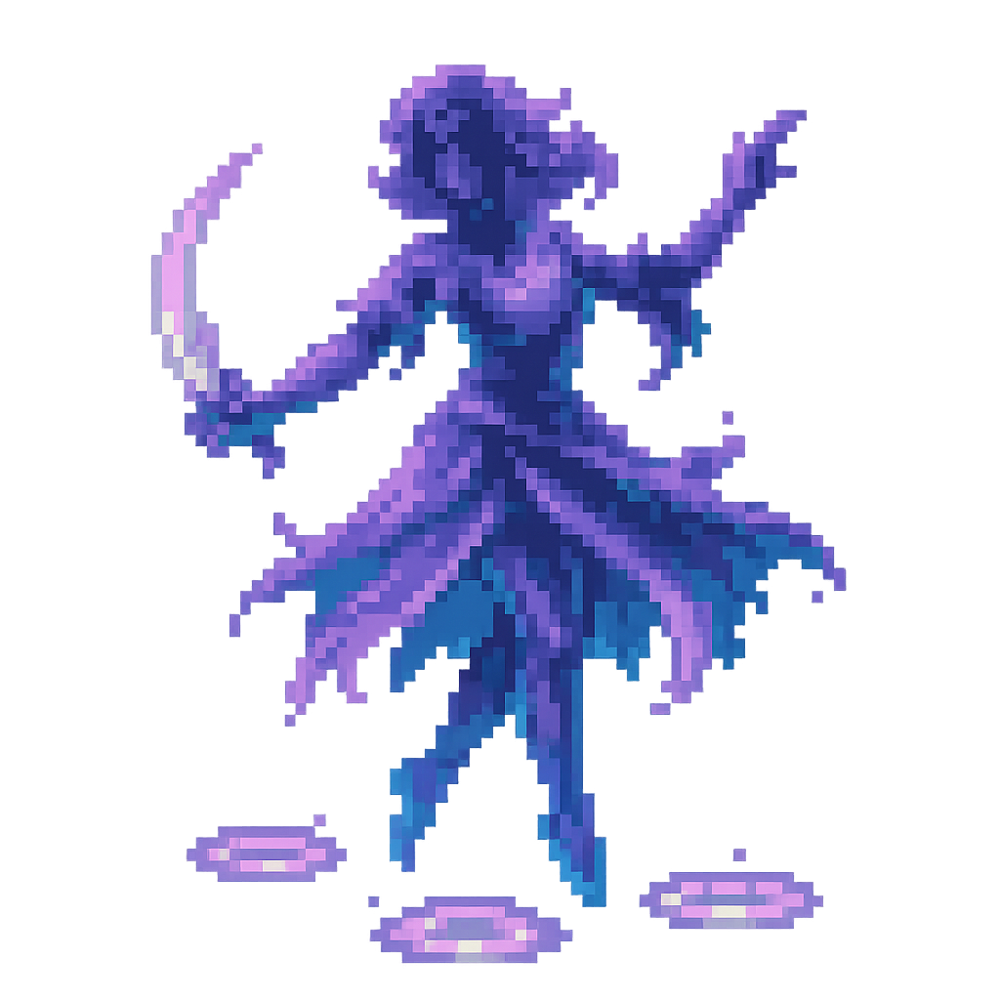
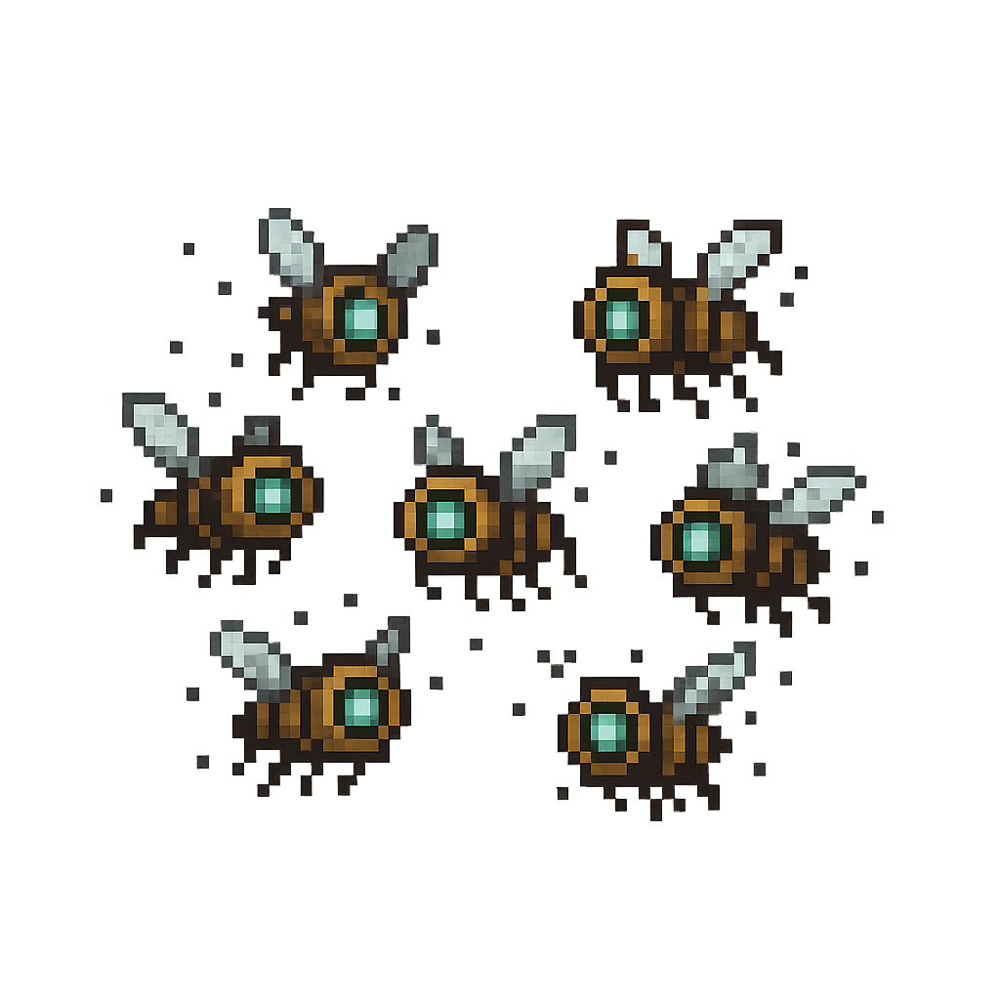

# 👹 Enemies – Bestiary Index

Structure per Entry:
- Name: Evocative and thematic, often involving color or light-based terms.
- Flavor Quote: A short, poetic line — mysterious, lore-rich, often ironic.
- Visual Design: Concise description of physical appearance.
- Behavior: Specific, interesting mechanic that ties into the world/lore.
- Weakness/Counterplay: Each has at least one specific counter or condition.

---

## 🌿 Enemy Concepts for Huevale – The Verdant Frontier

A realm where nature overgrows memory, 
where alchemy breathes through every bloom 
and the line between life and illusion is blurred by moss and mist.  
Here, plants whisper forgotten names, and the forest dreams half-truths in pollen and sap.

The enemies of Huevale embody its contradictions 
— playful yet predatory, beautiful yet toxic, whimsical yet deeply rooted in decay and rebirth.  
They are nature’s mischief and its mercy, wrapped in petals, thorns, and memory-laced spores.

Click to see Huevale's enemy list

---

### [Sapborn Stalker](./enemies/sapborn-stalker.md)
> “Roots remember where you stepped.”

Semi-humanoid creature made of twisting sap and bark.  
Burrows through roots to ambush.  
Weak to fire and severing effects.  
Camouflages among foliage when still.

---

### [Boglight Mimic](./enemies/boglight-mimic.md)
> “Some will-o’-the-wisps aren't lost. They're hunting.”

Glowing green-blue orbs that lure players into swamp traps.  
On close approach, transforms into a leeching spirit.  
Weak to light-based spells or illusions.

---

### [Verdant Maw](./enemies/verdant-maw.md)
> “A flower with teeth is still a flower.”

Giant carnivorous plant rooted in place.  
Lures players with illusory items or NPCs, then snaps.  
Can be bypassed with stealth or charmed with Limerick Druid’s flute.

---

### [Sporekin](./enemies/sporekin.md)
> “Born of breath, fed by decay.”

Child-sized fungal husks with mossy faces and glowing eyes.  
Release hallucinogenic spores that alter controls or visuals.  
Immune to poison, vulnerable to sonic and purifying effects.

---

### [Thornwrithe Beast](./enemies/thornwrithe-beast.md)
> “It bleeds bramble. And it’s fast.”

Quadruped overgrown with thorns and vines.  
Leaves a trail of entangling roots, lunges from the underbrush.  
Can be slowed with earth magic, enraged by Crimson.

---

### [Limeroot Trickster](./enemies/limeroot-trickster.md)
> “It rhymes, then strikes.”

Illusion-casting spirit that copies Limerick Druid’s mannerisms.  
Speaks in reversed limericks, casts mirror illusions to disorient.  
Must be unrhymed (interrupted spellcasting) to break illusions.

---

### [Chartreuse Husk](./enemies/chartreuse-husk.md)
> “A tonic left too long to rot.”

Once-human monk bloated by corrupted potions.  
Sprays acidic laughter mist (damages and causes confusion).  
Bursts on death, leaving puddles of unstable alchemy.

---

### [Grovebound Sentinel](./enemies/grovebound-sentinel.md)
> “The trees gave it orders. It never stopped listening.”

Animated wooden golem clad in emerald vines.  
Guards sacred ruins, resists all elemental magic.  
Can only be disabled by solving nearby environment puzzle.

---

### [Fangbloom Wyrm](./enemies/fangbloom-wyrm.md)
> “Buried in blossom, it waits for motion.”

Snake-like vine beast hiding beneath flower beds.  
Emerges to grab and constrict, then slithers back.  
Detected only with Skobeloff Lens or Echo spells.

---

### [Mossgrave Revenant](./enemies/mossgrave-revenant.md)
> “Even the ghosts here wear green.”

Verdant-armored specter of a fallen knight.  
Channels dream-poison through sword swings.  
Weak to light and memory-based attacks (e.g. Celadon Shards).

---

## 🔥 Enemy Concepts for Vireya – The Ember Expanse

A land still burning with old battles, 
where war-scarred sand and sun-baked metal hold the rage of a thousand sacrifices.  

The ground glows with residual heat 
— not just from flame, but from unburied grudges and remembered glory.

Vireya’s enemies are fanatics and fragments: forged in fire, dressed in fury.  
Some fight for lost causes, others don’t know the war is over.  
Every blow here is a history lesson written in blood and smoke.

Click to see Vireya's enemy list

---

### [Ashwrought Colossus](./enemies/ashwrought-colossus.md)
> “Built for war. Reforged by memory.”

Towering construct made from molten iron and ancient siege wreckage.  
Emits heat waves that drain stamina.  
Can be staggered by fire magic — it absorbs too much and cracks.

---

### [Crimson Echo](./enemies/crimson-echo.md)
> “Battle never ends when memory screams louder than death.”

A ghostly warrior trapped in an eternal duel loop.  
Reflects the last hit it received, forcing players to adapt.  
Weak to silence and time-breaking effects.

---

### [Fox Mirage](./enemies/fox-mirage.md)
> “Blink once — it’s gone. Blink again — it’s behind you.”

Illusory predator mimicking Nacarat’s trickery.  
Leaves illusory duplicates that confuse AI targeting.  
Revealed only in mirrored terrain or by Cinnabar Seal.

---

### [Searblood Cultist](./enemies/searblood-cultist.md)
> “Their veins boil. Their gods demand it.”

Blood-sacrificing zealots that set themselves aflame to empower attacks.  
Explode on death, igniting the terrain.  
Can be pacified briefly by Crimson Weaver’s thread.

---

### [Lava-Fused Behemoth](./enemies/lava-fused-behemoth.md)
> “Born in magma. Tempered by wrath.”

A monstrous, slow-moving beast with obsidian skin and cracks of flame.  
Cannot cross cooled earth (can freeze lava paths).  
Weak spot: molten vent on its back.

---

### [Red Widow](./enemies/red-widow.md)
> “Her kisses are funerals.”

Assassins dressed in red lace armor.  
Use heat mirage cloaking, darting in and out of visibility.  
Can charm NPCs mid-fight or turn them on the player.

---

### [Bannerbound Revenant](./enemies/bannerbound-revenant.md)
> “It doesn't remember who it fought for — only that it must keep marching.”

A spectral soldier dragging a burning banner behind.  
Each flag raises fallen warriors as lesser shades.  
Silence the banner (or steal it) to weaken them.

---

### [Glasslash Serpent](./enemies/glasslash-serpent.md)
> “Born of heat and betrayal.”

Lava-glass snake with razor scales.  
Shatters into sharp projectiles when hit.  
Weak to vibration (use drum-based or sonic magic).

---

### [Funeral Dancer](./enemies/funeral-dancer.md)
> “She dances to end things. And always ends with a bow.”

Spinning dancer in ceremonial garb.  
Slashes in wide arcs while laughing eerily.  
Leaves a glowing sigil on the ground — triggers a delayed explosion.

---

### [Bloodroot Effigy](./enemies/bloodroot-effigy.md)
> “Built of martyr bones. Fueled by prayer.”

A twisted golem built from the remains of heroes, infused with Crimson Bloom essence.  
Each strike on it hurts both the player and the attacker, unless the player is Verdant-bound.  
Best defeated through stealth or puzzle triggers.

---

## 🌊 Enemy Concepts for Iriseld – The Tidespire Reach

Suspended between storm and sky, 
Iriseld is a place where grief rides the wind and truth flickers like lightning over distant waves.  
Islands float on memory; the sea sings with illusion and longing.

The enemies here drift like dreams 
— beautiful, sorrowful, storm-touched things that strike with elegance and vanish like regret.  
They attack not just your body, but your sense of time, sound, and self.

Click to see Iriseld's enemy list

---

### [Glassborne Echo](./enemies/glassborne-echo.md)
> “It doesn’t shatter. It reflects you... wrong.”

Phantom entity formed from broken enchanted glass.  
Mimics the player’s last movement pattern — delayed mirror attacks.  
Shatters into sharp arcs when hit by lightning.

---

### [Skycall Wraith](./enemies/skycall-wraith.md)
> “The wind lost its name. So it screams.”

Pale, robed specters drifting on updrafts.  
Emit disruption shrieks that disable gliding and storm-gliding for short durations.  
Weak to grounded attacks and heavy elements.

---

### [Abyssal Current](./enemies/abyssal-current.md)
> “The tide remembers. The tide regrets.”

Serpentine water creature made of living memory-water, hunts near storm-wrecked coasts.  
Shifts between water and vapor; hits drain memory charges (disabling certain passive buffs).  
Temporarily banished by Zaffre Vial or Mind Echo abilities.

---

### [Stormwrit Hound](./enemies/stormwrit-hound.md)
> “It howls in lightning — and leaps between bolts.”

Four-legged skybeast made of cloud, wire, and plasma.  
Attacks with flash-teleports and static fields.  
Weak to harmonic resonance (e.g. flute, skybell chimes).

---

### [Sorrowwing](./enemies/sorrowwing.md)
> “It cries your name before you hear it.”

Ghostly birdlike creatures with humanlike eyes.  
Emit a sorrowful call that pulls the player toward ledges.  
Blocked by Cerulean Cloak or resisted with a memory artifact.

---

### [Tempest Marionette](./enemies/tempest-marionette.md)
> “She dances on wires strung from lightning.”

Sky-dancer puppet animated by storm-energy.  
Fights with aerial combos; parries magic with elegance.  
Can be overloaded by storm surge spells.

---

### [Whisperglass Wyrm](./enemies/whisperglass-wyrm.md)
> “You never hear it speak. But the cliff listens.”

Semi-transparent serpent that burrows through sky-islands.  
Spawns illusions of falling paths or invisible foes.  
Best revealed using Payne’s Brush or Skyglass Prisms.

---

### [Tideworn Apostle](./enemies/tideworn-apostle.md)
> “She drowned for knowledge. Now she walks for silence.”

Sea-cloaked undead scholar with glowing journal pages.  
Casts ink-black storm runes that scramble spell targeting.  
Weak to silence and fire.

---

### [Feathered Null](./enemies/feathered-null.md)
> “The wind gave up. It became still.”

A hovering, colorless humanoid creature with shredded wings.  
Disables storm-based traversal nearby.  
Can only be defeated with a combo of hue-bound gliding and memory reactivation.

---

### [Mirrorwake Duelist](./enemies/mirrorwake-duelist.md)
> “She fights in reflections. Yours. Hers. Anyone’s.”

> [!WARNING] No sprite yet...

<!--  -->

Illusory swordmaster from the ancient Skyglass arena.  
Moves unpredictably; teleports through mirrored surfaces and puddles.  
Can only be struck when reflected in water or glass at the same time.

---

## 🟣 Enemy Concepts for Myrrala – The Blooming Veil

A feytouched realm of glamour, illusion, and dream-born trickery.  
Here, reality is a suggestion, identity is a costume, 
and the flowers ask questions you forget answering.  

Nothing is as it Click to seems — and even that truth is suspicious.

Myrrala’s enemies laugh as they strike.  
They dance, echo, mimic, and mislead.  
To survive is to remember what’s real… if anything is.

Click to see Myrrala's enemy list

---

### [Doppelshade](./enemies/doppelshade.md)
> “You think it’s you. It hopes you don’t realize too late.”

Illusory clone that mimics the player’s appearance and recent combat style.  
Reacts to your previous inputs and predicts movement.  
Can only be revealed by indirect light or Thulian Mirror.

---

### [Lilyborn Mirage](./enemies/lilyborn-mirage.md)
> “It breathes petals. Then it asks questions you forget answering.”

Dreamlike humanoid formed from blooming lilies and shifting mist.  
Casts memory-loop illusions — repeating dialogue and actions.  
Best countered with rhythmic attacks or dialogue-based counters.

---

### [Chronopollen Sprite](./enemies/chronopollen-sprite.md)
> “Every sneeze moves the clock.”

Tiny, glowing fey that scatter time-warping pollen.  
Slows or speeds up local time randomly for both player and enemies.  
Can be trapped in dreamcatcher-like artifacts or frozen in a stasis loop.

---

### [Bloomveil Widow](./enemies/bloomveil-widow.md)
> “Draped in dusk. Her webs charm, then choke.”

Floating, spider-like entity wrapped in living silk and perfume.  
Uses charm pheromones and teleporting silk lashes.  
Vulnerable when mirrored or silenced.

---

### [Fandancer Fragment](./enemies/fandancer-fragment.md)
> “She’s still on stage, even if the stage burned down.”

Holographic echo of a past duel — performs dance-based blade attacks.  
Leaves glowing footprints that trap those who step in rhythm.  
Defeated by desynchronizing or breaking the rhythm pattern.

---

### [Razzflare Imp](./enemies/razzflare-imp.md)
> “Laughter that burns. Mischief that lingers.”

Tiny, fast-moving trickster that hurls bursts of chaotic glamour magic.  
Warps the visual UI briefly (e.g. health bar swaps, reversed camera).  
Can be grounded by music or rhythmic pulses.

---

### [Heliotropic Lurker](./enemies/heliotropic-lurker.md)
> “It Click to sees only light. But dreams in shadow.”

Stalker-type predator made of twilight and heliotrope vines.  
Blind to movement unless in light or during sunrise.  
Stronger if the player carries Heliotrope Band or casts light-based spells.

---

### [Thulian Vowkeeper](./enemies/thulian-vowkeeper.md)
> “It remembers every promise you made. Even lies.”

Shimmering knight formed from reflective crystal and oaths.  
Grows stronger the more dialogue-based choices the player has broken.  
Can be pacified or weakened through honesty (or tricked with illusion).

---

### [Glittering Grimoire](./enemies/glittering-grimoire.md)
> “It reads you when opened.”

Floating, sentient spellbook covered in sparkling runes.  
Summons phantom spells from the player’s past spell usage history.  
Must be “closed” via counter-rhythm or illusion feedback loop.

---

### [Veilshift Matron](./enemies/veilshift-matron.md)
> “You’re in her garden now. She decides where the paths go.”

Boss-class illusionist; shifts terrain during battle.  
Casts spatial glitches — teleports you slightly mid-dodge or mid-cast.  
Only damaged while her real form is visible (revealed by dialogue clues or Thulian Mirror).

---

## 🟡 Enemy Concepts for Luxeran – The Gilded Expanse

A land of blazing sun, sand-worn ruins, 
radiant illusions, and golden truths turned sharp.  

These enemies reflect the region’s obsession with light, 
trickery, vitality, and the cost of brilliance.

<!--
🟡 Luxeran Bestiary Themes:

Theme	Enemies Emphasizing It

- Mirage & Illusion:
  - Mirage Revenant, Ambercoil Asp, Mirrorthirst Wyrm
- Light as Weapon
  - Hollow Prophet, Sunflare Marionette, Citrine Golem
- Truth vs Trickery
  - Gamboge Djinnling, Cinnabar Scarab, Sundial Scarwalker
- Combat with Clarity
  - Sunburnt Jackal, Scarwalker, Wyrm (reading shadows, terrain, rhythm)
- Artifact-Specific Counters
  - Several enemies demand specific tools or environmental awareness, e.g. Orange Peel Charm, Eburnean Dice, memory-scent detection
-->

Click to see Luxeran's enemy list

---

### [Sunburnt Jackal](./enemies/sunburnt-jackal.md)
> “It never learned the difference between shadow and prey.”

Lean, sun-scorched predator with light-blind eyes.  
Tracks movement by heat signatures and scent.  
Weaker at night or in shadow; lunges toward heat-based spells or torches.

---

### [Mirage Revenant](./enemies/mirage-revenant.md)
> “You blinked. It was never there. But now it is.”

Shimmering specter that flickers in and out of visibility.  
Mimics helpful NPC silhouettes or glimmers as treasure chests before striking.  
Dispelled by true-vision items or bursts of non-elemental force.

---

### [Ambercoil Asp](./enemies/ambercoil-asp.md)
> “Even its scales lie.”

Golden serpent with reflective glassy hide.  
Coils around artifacts to mimic them, attacking when disturbed.  
Reflects light spells unless disrupted by sonic or echo attacks.

---

### [Gamboge Djinnling](./enemies/gamboge-djinnling.md)
> “A wish, half-spoken. A trick, fully paid.”

Tiny elemental born from scorched lamp remnants.  
Grants random buffs or debuffs on hit — chaotic allies or enemies.  
Tamed briefly with Orange Peel Charms or negotiation spells.

---

### [Cinnabar Scarab](./enemies/cinnabar-scarab.md)
> “It shines when afraid. Which is always.”

Swarm creature with shell that refracts firelight into false shadows.  
Explodes into decoy duplicates upon damage.  
Real one only harmed by AoE, aura, or memory-scent detection.

---

### [Hollow Prophet](./enemies/hollow-prophet.md)
> “It speaks in blinding truths… and burns away lies.”

Wandering preacher figure made of light and bone.  
Casts delayed flash-runes that disorient or invert camera movement.  
Defeated by silence spells or the Eburnean Dice (gambling memory sacrifice).

---

### [Citrine Golem](./enemies/citrine-golem.md)
> “A gem is eternal. So is its temper.”

Massive guardian built of fused yellow crystals and gold.  
Absorbs all light magic; shatters under extreme cold or echo-charged percussion.  
Best fought with reflected terrain or manipulated architecture.

---

### [Sunflare Marionette](./enemies/sunflare-marionette.md)
> “Dances on beams. Cracks like porcelain.”

Glass‑limbed puppet floating on sunlight threads.  
Creates solar hotspots on the field — standing in one heals it.  
Can be tangled using shadow or smoke-based mechanics.

---

### [Sundial Scarwalker](./enemies/sundial-scarwalker.md)
> “You can’t run from time. Especially when it’s hunting.”

Living sandstone warrior with a sundial for a face.  
Moves only when player does; attacks after shadow completes arc.  
Timing-based fight: strike only when its own shadow is cast forward.

---

### [Mirrorthirst Wyrm](./enemies/mirrorthirst-wyrm.md)
> “It swam through light until it forgot the sky.”

Serpentine desert wyrm made of reflected mirage currents.  
Swims below sand as if in water; surface glimmers mark its path.  
Can only be targeted when fully emerged — lured by illusion spells or rhythmic movement.

---

## 🟤 Enemy Concepts for Auralith – The Dimming Hollow

Where alchemies failed and souls linger in soot, 
Auralith is a world of slow decay and stubborn memory.  
It is a place where bones archive regret, 
and dust replays echoes of things better left forgotten.

The foes of Auralith are not evil 
— they are unfinished, unmourned, or misremembered.  
Their attacks drain more than health: 
they fray the truth of who you are, and who you once were.

Click to see Auralith's enemy list

---

### [Memory Husk](./enemies/memory-husk.md)
> “A shell of who you were… or might become.”

A ghostly figure that resembles a past version of the player.  
Mimics a skill or item the player once used.  
Defeated by replaying correct memory sequences or confronting it in dialogue.

---

### [Sootshade Collector](./enemies/sootshade-collector.md)
> “It gathers burnt truths. And whispers them.”

Cloaked entity made of ash and charred parchment.  
Uses memory-reveal fog that forces the player into past trauma moments.  
Immune to fire; vulnerable to silence spells or Bistre Lantern.

---

### [Caput Marionette](./enemies/caput-marionette.md)
> “They were never truly alive — just waiting to be dismissed.”

Alchemically animated corpses, leaking rust and dried crimson.  
Shamble slowly until triggered by player interaction with certain relics.  
Explode in decay clouds on death unless dispelled first.

---

### [Ochre Golem](./enemies/ochre-golem.md)
> “It doesn’t move fast. It moves deliberately.”

Stone guardian carved by the Burnt Sienna Sculptor.  
Will not engage until a player breaks a nearby object, then tracks them relentlessly.  
Temporarily pacified by placing the correct memory tokens nearby.

---

### [Rustworn Judge](./enemies/rustworn-judge.md)
> “Its verdict was written in corrosion.”

A tall armored specter with cracked lacquered blades.  
Initiates trials on players — disables HUD and forces “honor duels.” 
Can be outwitted with memory-based bluffing.

---

### [Wickbone Lantern](./enemies/wickbone-lantern.md)
> “A cage of ribs, a candle of memory.”

<!--  -->
<!--  -->

Undead creature with a flame sealed inside its chest.  
Lights up rooms — but if followed too closely, triggers soul traps.  
Flame can be transferred to unlock ghost-locked doors.

---

### [Alchemical Echo](./enemies/alchemical-echo.md)
> “It dissolved... but not enough.”

Twisted being mid-transmutation — half metal, half mind.  
Shoots unstable potion orbs that warp player abilities (swap healing for harm, for example).  
Temporarily stabilized using Caput Mortuum Phylactery.

---

### [Ashweaver Recluse](./enemies/ashweaver-recluse.md)
> “Spins memories into traps.”

Spider-like entity that spins memory webs in narrow corridors.  
Touching a thread plays past player choices as whispers — too many cause panic/fear debuff.  
Can be burned or disrupted with loud sound/light.

---

### [Tapestry Watcher](./enemies/tapestry-watcher.md)
> “It stares at the wall where you betrayed yourself.”

A hooded figure pinned to a giant weaving of player past decisions.  
Uses threads of past regrets to bind the player in guilt — paralyzes on misremembered dialogue.  
Beaten through confession or by wielding truth artifacts.

---

### [Phylactery Swarm](./enemies/phylactery-swarm.md)
> “Tiny. Hungry. Each holds a name they never earned.”

Cloud of hovering, brass-eyed insects bound to old soul fragments.  
Each one steals a piece of the player’s stored XP/memories on contact.  
Dispersed by fire, echo pulses, or by feeding them a forgotten name.

---

## ⚫ Enemy Concepts for Nullshade – The Colorless Core

The void where hue was broken, and memory exiled itself to silence.  
Geometry fractures. Time lurches. Voices echo from forgotten futures.  
Here, nothing attacks you directly — it asks you to attack yourself.

Enemies in Nullshade are reflections, contradictions, remnants.  
Some remember you before you entered. Others rewrite you when struck.  
You do not defeat them — you must un-become what they recognize.

Click to see Nullshade's enemy list

---

### [Prism Unform](./enemies/prism-unform.md)
> “A hue that forgot what it was.”

Shifting spectral figure that constantly flickers between hues — its form glitches.  
Attacks mimic abilities from all Orders, but in incomplete, unstable forms.  
Becomes more violent the more hues you’ve unlocked.

---

### [The Bound](./enemies/the-bound.md)
> “They stood still long enough… and became silence.”

The stone figures scattered across Nullshade.  
Some awaken with slow, judgmental movements, using delayed, powerful strikes.  
Resist all hue magic — can only be calmed or undone by memory artifacts or player dialogue.

---

### [Nullshade Echo](./enemies/nullshade-echo.md)
> “It doesn’t attack. It remembers you doing so.”

Ghostly silhouette that replays your past actions — literal echoes of your earlier fights, dialogue choices, or attacks.  
Killing it causes a momentary rewind, undoing your last movement or decision.  
Defeated only through nonviolent means (e.g., standing still, choosing silence).

---

### [Fractal Shardling](./enemies/fractal-shardling.md)
> “A thought. A shape. Repeating until it breaks.”

Jagged, floating prism fragment with recursive movement patterns.  
Fractures when struck, duplicating itself in smaller, faster versions.  
Eventually collapses into a silent burst that rewrites nearby terrain.

---

### [Wound Remnant](./enemies/wound-remnant.md)
> “It bled light. Now it bleeds memory.”

A cracked, semi-humanoid construct born from the Prism Wound.  
Attacks cause the screen to fade briefly to white or gray, distorting player senses/UI.  
Emits ambient whispers from the shattered Core.

---

### [Shatterglass Choir](./enemies/shatterglass-choir.md)
> “They sing. The color leaves your screen.”

Cluster of floating childlike silhouettes, each a broken hue echo.  
Emit a color-draining hum — draining the world of saturation as they chant.  
Must be silenced in the order of color loss (e.g. ROYGBV → gray).

---

### [Null-Root](./enemies/null-root.md)
> “The Core tried to grow again. It failed beautifully.”

Void-black vine-beasts wrapped in crystallized color veins.  
Burrow into geometry and drag chunks of environment as weapons.  
Vulnerable to self-sacrifice: must let them strike a fragment of the Prismwalker to activate their decay.

---

### [Silence Incarnate](./enemies/silence-incarnate.md)
> “It watches. It judges. It never blinks.”

A cloaked, hovering enemy that never moves — only watches.  
As long as it Click to sees you, you cannot cast or dodge.  
Must break its line of sight using warped architecture or bending light.

---

### [Memory Leech](./enemies/memory-leech.md)
> “What it bites, it forgets for you.”

Insectoid shape with crystal mandibles; feeds on the player’s HUD, memories, and controls.  
Causes you to forget controls momentarily (remapping buttons or hiding prompts).  
Defeated by triggering true memories — usually from collected lore items.

---

### [Tapestry Watcher](./enemies/tapestry-watcher.md)
> “It weaves choices you didn’t make. Then punishes you for forgetting them.”

> [!NOTE] (Previously introduced in Auralith but echoes in Nullshade)

> [!WARNING] no image yet, using auralith's version for now...

<!--  -->

Appears again in Nullshade — but broken, flickering, mirroring forgotten possibilities.  
Now exists across multiple points in space 
— each version mutely reacting to different player decisions not taken 
(e.g., unchosen dialogue trees, skipped side quests).  
To escape it, the player must choose a new “first decision” and overwrite a prior truth.

---

### [The Seventh Hue](./enemies/the-seventh-hue.md)
> “It was never named. So it never died.”

> [!WARNING] no image yet...

<!--  -->

A mythic enemy hidden behind the optional puzzle path ("The hue that never had a name").  
Appears only if the player solves five or more Nullshade prism riddles without error.  
It mirrors nothing — instead, it attempts to invert the player’s core attributes.

If defeated, unlocks an optional dialogue path before the final boss: **“What if the Prism was wrong?”**

---

### [The Colorless Shape](./enemies/the-colorless-shape.md)
> “It is everything. And it is no one.”

Boss-tier elite enemy — a shifting, humanoid mirror that reflects your loadout and current hue alignment.  
Uses your current spells, weapons, and actions against you, but distorted.  
Final form before the boss; its final words echo your first dialogue choice in the game.

---

## 🌐 Unbound / Cross-Regional Entities
These appear across multiple zones, during special events, or under narrative triggers:

Click to see Undbound enemy list

---

### [Nullborn Husks](./enemies/nullborn-husks.md)
> "They are not undead. They are unmade..."

Their movements **glitch reality** briefly — distorting hue around them.  
They emit a faint **color static**, a sound like someone whispering a name you've forgotten.  
Attacking them risks being drained of hue — causing **temporary colorblindness** or **ability inversion**.

---

### [Hue Leeches](./enemies/hue-leeches.md)
> “They shimmer with borrowed light — and leave you pale.”

Small, floating jellyfish-like creatures made of dripping, semi-transparent color.  
Latch onto players and drain hue, turning abilities gray for several seconds.  
Can be popped with AoE or flashed with strong color bursts.

---

### [Tyrian Echo](./enemies/tyrian-echo.md)
> “Not a person. A memory repeating itself into violence.”

A shimmering humanoid form looped in fragmented animation.  
Uses dreamlike movements and distorted Crimson/Violet spells.  
Represents a replay of a warrior from the Color War, trapped in echo.

---

### [Bloomrot Titan](./enemies/bloomrot-titan.md)
> “Where growth was unchecked, the root turned cruel.”

Massive, overgrown Verdant horror — fungus and bark fused around a desiccated core.  
Spawns poisonous pollen clouds and throws explosive Click to seed pods.  
Weak spot: glowing hollow in its twisted chest.

---

### [Wickerborn](./enemies/wickerborn.md)
> “They built guardians to watch color relics. The husks never stopped watching.”

Constructed from woven roots, vines, and bone.  
Guard old shrines, react to proximity with delayed pursuit, then berserk.  
Can reassemble unless burned or shattered with Crimson/Earthen.

---

### [Nullshade Revenant](./enemies/nullshade-revenant.md)
> “It remembers dying. It forgot why it came back.”

A once-colorful figure — now blackened, only faint trails of color remain.  
Phase-shifts between visible and invisible unless lit by certain hues.  
Heavy, slow attacker with aura that corrupts hue alignment on hit.

---

### [Moth-Witch of the Verdant Spiral](./enemies/moth-witch-of-the-verdant-spiral.md)
> “Eyes like blossoms, wings like whispers.”

A rare caster-type boss that controls swarms of Thalera moths.  
Uses Verdant and Cobalt spells to confuse, charm, and trap.  
Found in hidden glades; whispers riddles mid-fight.

---

### [Huefractals](./enemies/huefractals.md)
> “Fragments of forgotten color, shattered but sentient.”

Living shards of the Prismatic Core.  
Erratic movement; each piece glows with unstable hue-light.  
Collide with each other to create random chromatic effects.

---

### [Memory Grafter](./enemies/memory-grafter.md)
> “He does not take lives. He replaces them.”

A tall, cloaked humanoid with a scroll of names written in color-ink.  
Attacks using “rewrites”: steals your ability and replaces it with a fake one.  
Leaves color illusions of the player behind — like echoes.

---

### [Spectral Harvester](./enemies/spectral-harvester.md)
> “One swing, and your history falls away.”

Appears during Memory Echo segments if failed.
Wields a giant scythe of broken hues; deletes portions of the map or player memory.
Can only be banished by completing a lore puzzle or using Hue Reforge relics.

---

### [The Unhued Choir](./enemies/the-unhued-choir.md)
> “They sing the Prism’s dirge. Each note unmakes.”

A floating cluster of childlike Nullborns, singing in perfect harmony.  
Sound-based attacks that disrupt player input timing, HUD UI, and spellcasting.  
Can be silenced with specific color sigils or broken with sonic feedback.

---

## TLDR (W.I.P.)

Click to see <b>Enemy & Encounter Categories</b>

## Enemy & Encounter Categories

| Category                           | Mechanics & Examples                                                                                           |
| ---------------------------------- | -------------------------------------------------------------------------------------------------------------- |
| **Memory-Drainers**                | • **Abyssal Current**: proximity drains memory charges; banishable with Zaffre Vial.                           |
|                                    | • **Memory Leech**: latches to UI, disables buttons until Memory Echo cast.                                    |
|                                    | • **Hue Leeches**: swarm on hue use, gray-out abilities; burst AoE clears them.                                |
| **Illusory Predators**             | • **Bloomveil Widow & Boglight Mimic**: charm/mimic illusions → trap in loops; broken by Violet counters.      |
|                                    | • **Doppelshade & Fox Mirage**: mirror your form/afterimages; stagger by off-rhythm strikes or mirror-terrain. |
| **Elemental Constructs**           | • **Citrine Golem & Ochre Golem**: absorb certain hues (Yellow/Green), weak to Cobalt cold or vibration.       |
|                                    | • **Ashwrought Colossus**: area-denial heatwaves; stun by overheat vent attacks.                               |
|                                    | • **Alchemical Echo**: random status swaps; stabilize with Caput Mortuum phylactery.                           |
| **Spectral Echoes & Revenants**    | • **Crimson Echo**: duels you in looped attacks; break pattern with rhythm pauses.                             |
|                                    | • **Bannerbound Revenant**: momentum summoner; seize banner to end shades.                                     |
|                                    | • **Nullshade Revenant**: phase shifts unless lit by designated hue lanterns.                                  |
| **Arachnid / Trap-weavers**        | • **Ashweaver Recluse**: memory-web traps → “panic echo”; dispel webs with sound/flashes.                      |
|                                    | • **Spider Variants** (Bloomveil Widow’s webs, etc.) integrate similar trap loops.                             |
| **Boss-Scale Illusionists**        | • **Moth-Witch of the Verdant Spiral**: riddle choices reshape arena; wrong answer → shifting illusions.       |
|                                    | • **Veilshift Matron**: rewrites battlefield geometry; counter with mirror, “true map” buff.                   |
| **Time & Reflection Masters**      | • **Sundial Scarwalker**: mimics your movement with delay; stutter-step to confuse it.                         |
|                                    | • **Mirrorwake Duelist**: fights via reflections; break all local mirrors to remove her mobility.              |
|                                    | • **Whisperglass Wyrm**: burrows through reflective terrain; reveal with Mind Echo under glass.                |
| **Meta-Encounters (NG+, endgame)** | • **The Colorless Shape**: copies your build; untag hue → gains window to strike.                              |
|                                    | • **The Seventh Hue**: final paradox; requires truth prompt input to defeat.                                   |
|                                    | • **Unhued Choir**: sound-based HUD drain; defeat in inverted hue order.                                       |

---
