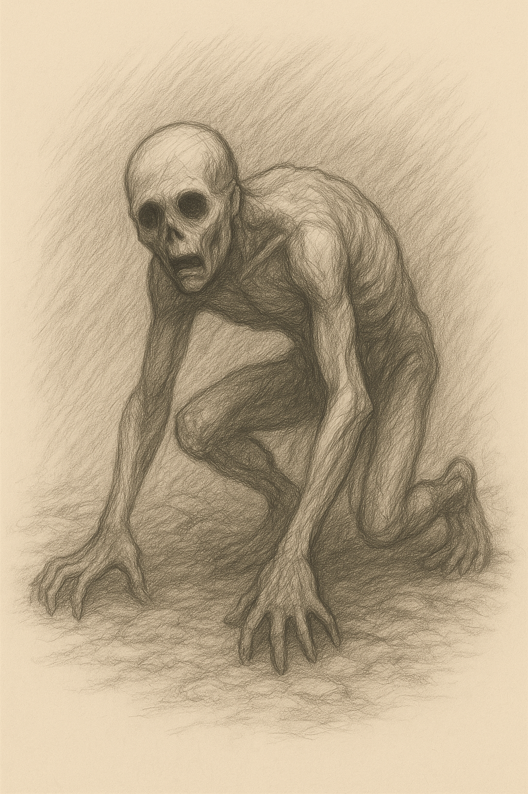

# Nullborn Husks – Spawn of the Shatter

  <h3>Nullborn Husk</h3>
  <i>Twitching creatures with void-filled eyes</i> 
  
   <i>"They are not undead. They are unmade..."</i>  

- Their movements **glitch reality** briefly — distorting hue around them.
- They emit a faint **color static**, a sound like someone whispering a name you've forgotten.
- Attacking them risks being drained of hue — causing **temporary colorblindness** or **ability inversion**.

---

## Lore Entry

See Nullborn Husks Lore Entry

### Lore Entry: From the Scroll of [placeholder], Last Verdant Archivist

> *“I write this in root-ink, though I know not if ink can hold what I must say.”*  

> *They came after the Core broke — crawling things, 
> pale and featureless, like clay left out too long. 
> But they were not blank. No… they were hollowed. 
> I watched a beast shudder and fall, not from wound, 
> but from forgetting itself entirely.*

> *One touched my companion, and in an instant her eyes dimmed. 
> She forgot her name. Forgot mine. 
> When I wept for her, the husk smiled. 
> It had taken something — not her blood, not her life, but her hue.*

> *I believe they were once like us. Carriers of color. 
> When the Prism ruptured, they were caught in the lightless tide that followed 
> — and in that moment, they were rewritten by absence.*

> *We call them **Nullborn**, but that name is a mercy. They are not born. 
> They are what’s left when all birth, all memory, all color has bled out.*

> *If you see one, do not speak. They remember sounds. 
> If you feel yourself forgetting, run. 
> And if you hear your name from their mouths — it is already too late.*

> *— [placeholder], on the eve of the Tyrian Eclipse*

---

## Bestiary Entry

| **Name:**          | Nullborn Husk                                       |
| ------------------ | --------------------------------------------------- |
| **Type:**          | Aberration / Colorless Horror                       |
| **Threat Level:**  | ⚠️ Moderate – Highly Disruptive to Hue-Bound Players |
| **First Emerged:** | Post-Shattering Era                                 |

### Description:  
When the **Prismatic Core** shattered, 
it did not just scatter hues — it **tore color from beings** too close to the explosion. 
The Nullborn Husks are the result: creatures not dead, but **unmade**.  

Their eyes are black wells of absence, 
their skin like dried ash, their voices a rasp of forgotten names. 
They crawl rather than walk, twitching with phantom memories of what they once were.

### Hue Interaction:
- Immune to color-based manipulation.
- Proximity distorts **Hue UI** and disables **passive color regen**.
- Contact may cause **Hue Drain**: temporarily strips player of active hue-binding.

### Behavior:
- Drawn to strong hues and relics.
- Often found **near shattered color sites**, old ritual grounds, or corrupted relics.
- Avoid light but are **not harmed by it**.

### Known Weaknesses:
- Vulnerable to **Crimson flame** and **Earthen decay**.
- Momentarily stunned by **Memory Echo** effects (Cobalt or Earthen).

### Notes:  
Whispers suggest these husks still "remember" color.  
Some report hearing **their own voices echoed back** moments before an attack.

---

<!-- ## Lore

When the **Prismatic Core shattered**, it did more than rupture reality 
— it bled color into the world and **ripped it from other things**.  
From the cracks where color fled, **the Null was born** — not a hue, but a hunger.  
These crawling horrors, known as **Nullborn Husks**, are its first children.  

Once people — sages, soldiers, even flora touched by hue — 
these creatures were caught too close to the Core’s explosion.  
As color was torn from their being, **they hollowed**.  
Their flesh did not rot, but **dimmed**.  
Their eyes did not close, but opened wide — and stayed that way, 
filled with **void where once there was soul**.  

Now they slither through places where hues once danced, 
drawn to **color like moths to flame**, twitching in silent pain.  
They don't feed on flesh. They feed on **essence — memory, identity, and light**.

--- -->
