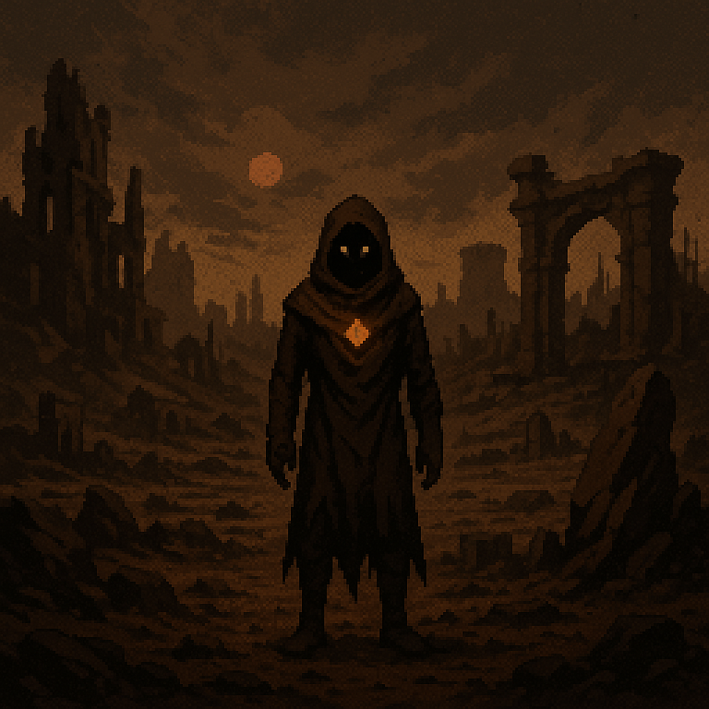

# 🤎 Auralith – *The Dimming Hollow (Brown/Neutral)*

  <h3>Auralith</h3>
  
   <i>Rusted ruins & fossil memory</i> 

## Overview

- **Name:** Auralith  
- **Biome:** Crumbling ruins, ash plains, fossilized alchemical labs, ruins, ash fields  
- **City:** *Mortuum Hold* – Fortress-monastery built in rusted stone and bone  
- **Inhabitants:** Alchemists, archivists, revenants, soulbinders  
- **Visuals:** Faded textures, ochre tones, rusted architecture  
- **Hazards:** Memory ghosts, unstable alchemy fields, soul traps  
- **Gameplay:** Resource crafting, permanent death avoidance, memory-based puzzles  
- **Key Locations:** Mortuum Hold, Isabelline Catacombs, Phylactery Vault  
- **Key Characters:** Caput Mortuum Ascetic, Isabelline Widow  
- **Artifact Examples:** Bistre Lantern, Burnt Sienna Golem Core  

**Environmental Twist:**  
You leave behind “ghosts” of past deaths/actions that either help or haunt you later.

---

## Mortuum Hold

---
