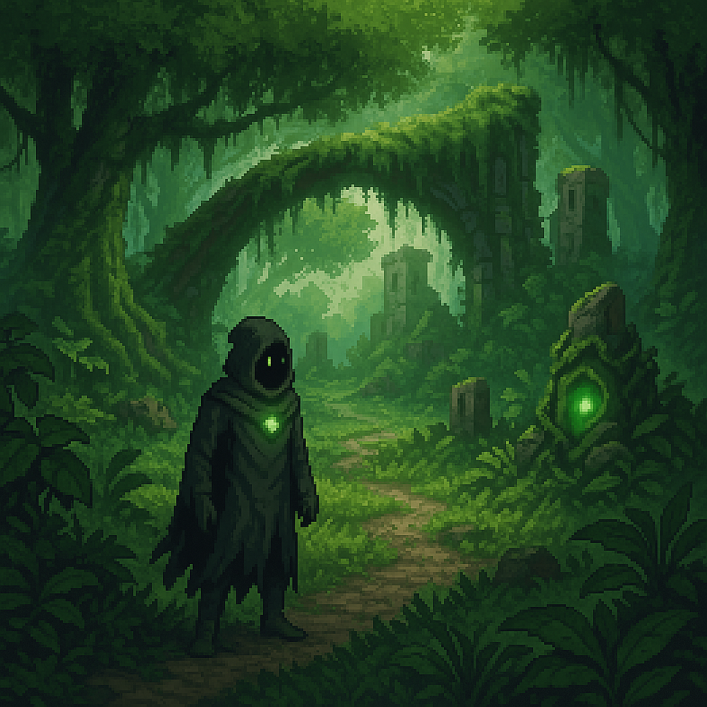

# 🟢 Huevale – *The Verdant Frontier (Green)*

  <h3>Huevale</h3>
  
   <i>Verdant growth & stealth puzzles</i> 

## Overview

- **Name:** Huevale  
- **Biome:** Verdant forests, bogs, overgrown ruins  
- **City:** *Tinctara* – A moss-covered archive built into living trees  
- **Inhabitants:** Druids, herbalists, swamp cults, nature-bound spirits  
- **Visuals:** Dense foliage, shifting canopies, runic roots  
- **Hazards:** Overgrowth, plant-based traps, swarming insects  
- **Gameplay:** Growth/puzzle mechanics, stealth, nature-based magic  
- **Key Locations:** Tinctara Archives, Malachite Grove, Saproot Shrine  
- **Key Characters:** Xanadu Warden, Malachite Oracle  
- **Artifact Examples:** Saproot Idol, Chartreuse Tonic  

**Environmental Twist:**  
Vegetation regrows dynamically. Paths open/close as forests shift; vines and roots respond to magic.

---

## Tinctara

> *From tincture, suggesting color + alchemy*

---
