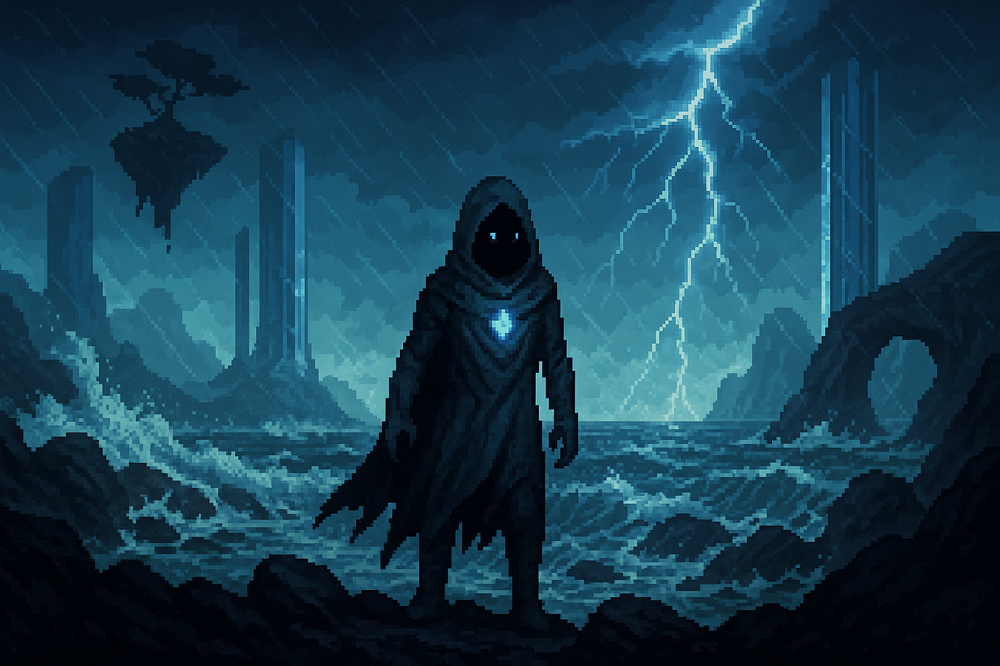

# 🌊 Iriseld – *The Tidespire Reach (Blue)*

> “Suspended between storm and sky, Iriseld is a place where grief rides the wind 
> and truth flickers like lightning over distant waves.”

A realm of floating islands, refracted storms, and illusion-bound skyglass.  
The air carries memories, songs, and gravity distortions.  
Rain falls upward. Music forms bridges.  
Colors here shimmer with regret, clarity, and fragile beauty.

  <h3>Iriseld</h3>
  
   <i>Floating sea-cliff archipelago</i> 

## Overview

- **Name:** Iriseld  
- **Biome:** Coastal cliffs, stormy oceans, floating sky islands, storm-swept plains, bioluminescent reefs  
- **City:** *Zaffran Port* – Harbor-city built of cobalt glass and wind-powered sails  
- **Inhabitants:** Seers, glasswrights, sky monks, tide-singers, illusionists, sea-folk  
- **Visuals:** Mist-wrapped towers, lightning-flickered skies, airborne spires, reefs glowing beneath shattered waves  
- **Hazards:** Wind puzzles, shifting tides, lightning strikes  
- **Gameplay:** Movement/air puzzles, vertical traversal, weather-based mechanics  
- **Key Locations:** Zaffran Port, Whispering Bay, Skyglass Pillars  
- **Key Characters:** Cerulean Skydancer, Zaffre Glasswright  
- **Artifact Examples:** Zaffre Vial, Cerulean Cloak  

**Environmental Twist:**  
Wind direction changes areas’ accessibility.  
Control storms or ride them using color artifacts.  
Rain may fall upward; gravity often bends near floating glass structures

### Gameplay Themes:
- Vertical traversal
- Memory/illusion puzzles
- Sound/wind-based navigation
- Emotional resonance unlocking sealed locations

### Aspected Emotions:
- Wisdom, sorrow, memory, introspection, longing

### Core Associations:
- Sound and silence
- Rain and reflection
- Wind as messenger, storm as emotion
- Illusions tied to trauma or desire

### Common Mechanics:
- Mind Echoes
- Static Dash (blink-style movement)
- Memory-charged relics
- Buffs/nerfs tied to ambient music or rhythm

---

## 🎨 Hue Affinity:

- Primary: 🟦 Cobalt (Blue) — intellect, memory, spirit, illusion

- Secondary Themes: Violet (dreams, identity), Verdant (memory-rooted growth), Crimson (echoes of past conflicts)

---

## 🧠 Core Mechanics:

- Traversal puzzles based on rhythm, wind, and floating geometry.
- Memory Echoes shape the geography — revealing paths or distorting time.
- Enemies disrupt perception, mobility, or sound (e.g., silencing gliders, warping echoes, disabling buffs).

---

## 📍 Key Locations
- Zaffran Port: City of flying sails and cobalt towers. Half-drowned in fog.
- Whispering Bay: A cove where drowned names echo from beneath the surface.
- Skyglass Pillars: Floating shards that hum with weather-stored memories.
- The Mirrorwake: A sea where reflections linger longer than the real.

---

## 🧍‍♂️ Important NPCs (So Far):

### 🧪Zaffre Glasswright (Referenced in Memory Echo)
Artisan of memory-sealing glass; creates living vials and whisperpanes.

- A sorrowful figure who sealed a memory inside a vial to save someone.
- May appear physically later or be an Echo-only character tied to deeper lore or a storm-locked relic.

Item: Zaffre Vial — contains tears or memories; reveals what was buried.

> “Let him forget me. If it will let him live.”

> “Glass keeps what words forget.”  
> “This vial doesn’t show you what’s hidden 
> — it shows you what you buried.”

---

### 💃 Cerulean Skydancer – Spirit of the Storm Hymn
Messenger of wind spirits; dances in midair to communicate with the storm.

- Found in “The Skyglass Hymn” scene.
- Ethereal, floating figure who teaches the player to “move with the wind” rather than fight it.
- Delivers cryptic wisdom about letting go vs. clinging to control.
- Possibly connected to Iriseld’s wind-memory mechanics or the Zaffre Glasswright.

Item: Cerulean Cloak — grants lightning immunity and grace in freefall.

> “Your feet cling to stone. That is why you fall.”

> “Flight is a promise — not to fall, but to keep dancing.”

---

### 🪶 Glaucous Wing
Avian shapeshifter and guardian of the high cliffs; feathers carry forgotten winds.

Item: Glaucous Feather — grants silent hover or bird-communication.

> “Storms nest in my ribs. I just let them breathe.”

---

### 🪞 Payne’s Shade
Painter of illusions, soul-fragments, and impossible skies.

Item: Payne’s Brush — illusions persist until someone stops believing.

> “What you see isn’t false — it’s just unfinished.”

---

### 🖤 Eigengrau the Unseeing
Blind seer who gazes inward to understand truth. Dwells at the edge of visibility.

Item: Eigengrau Prism — reveals subconscious fears or desires.

> “Fear isn’t a wall. It’s a mirror with dust on it.”

---
