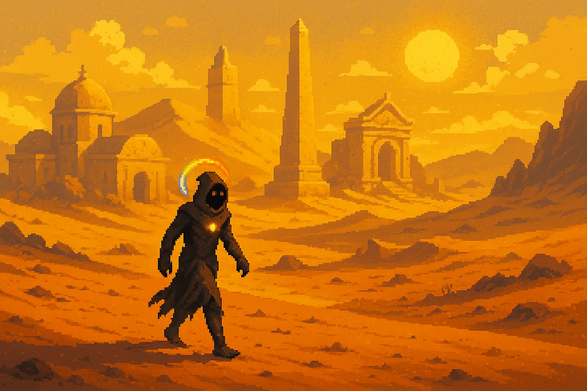
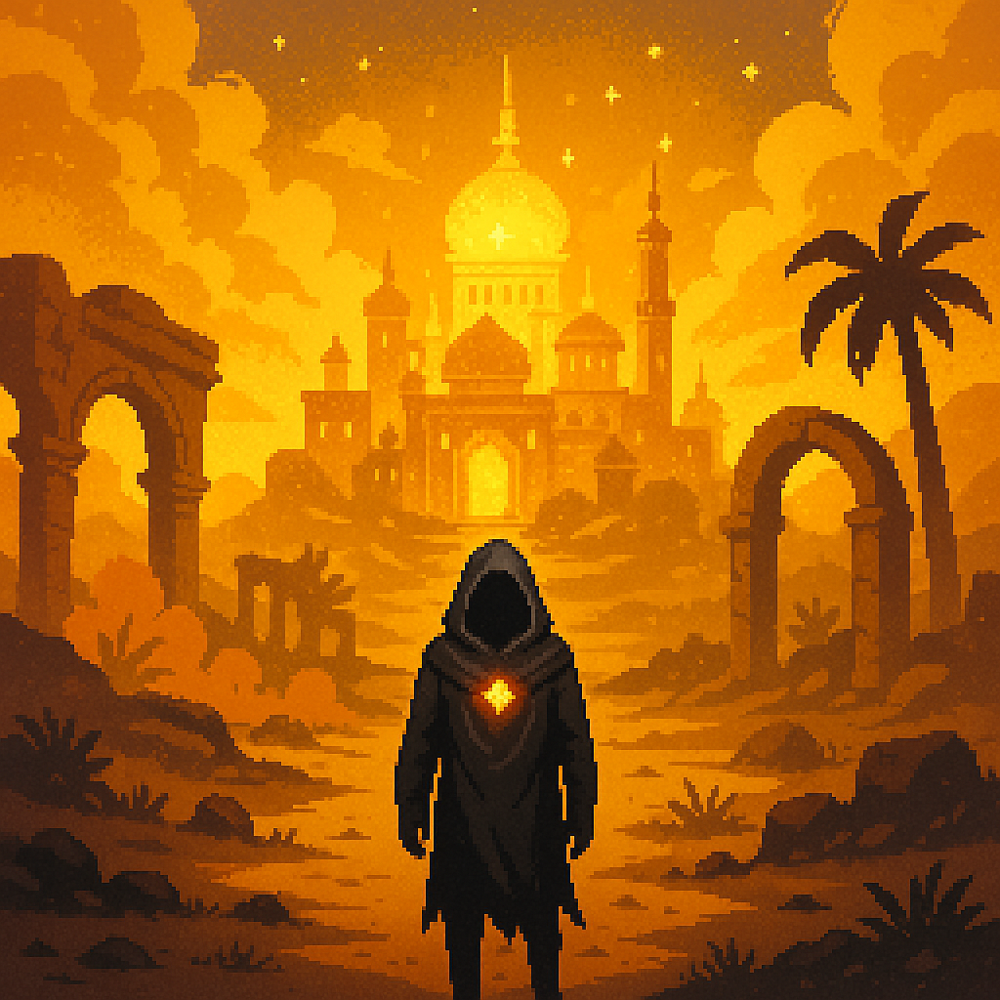

# 🟡 Luxeran – *The Gilded Expanse (Yellow/Orange)*

  <h3>Luxeran</h3>
  
   <i>Mirage-laced golden desert</i> 

## Overview

- **Name:** Luxeran  
- **Biome:** Golden deserts, citrus orchards, sun temples, desert, savannah, citrus groves  
- **City:** *Eburnea* – City of bone-white domes and blazing towers  
- **Inhabitants:** Traders, sun-priests, relic diggers, light casters  
- **Visuals:** Blinding light, mirages, sun-reflecting stone  
- **Hazards:** Light-based puzzles, sandstorms, false paths  
- **Gameplay:** Economy mechanics, reputation-based progression, mirage illusions  
- **Key Locations:** Eburnea City, Gamboge Vault, Aureolin Temple  
- **Key Characters:** Citrine Artisan, Gamboge Monk  
- **Artifact Examples:** Aureolin Quill, Orange Peel Charm  

**Environmental Twist:**  
Mirages appear on the map; only true vision (via artifacts) shows real paths or oases.

---

## Eburnea

  <h3>Eburnea</h3>
  
   <i>City of bone-white domes and blazing towers</i> 

---
