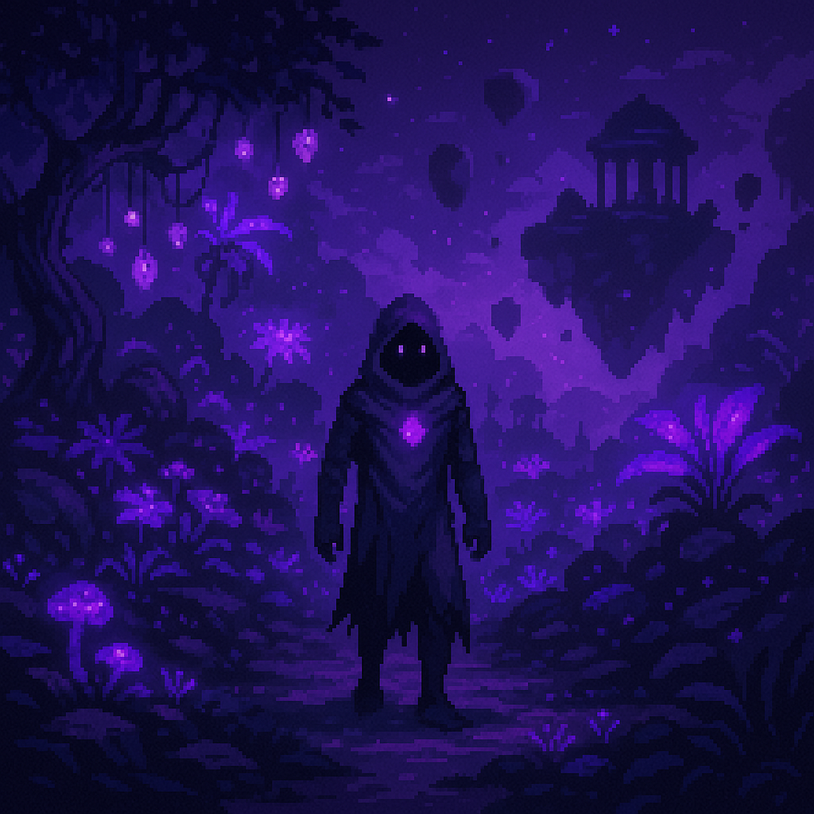

# 🟣 Myrrala – *The Blooming Veil (Purple)*

> Illusion, identity, soft tragedy, and mirrored beauty.

Twilight meadows, bioluminescent groves, fae-glades, glowing meadows, and crystal gardens.

  <h3>Myrrala</h3>
  
   <i>Twilight glades of illusion</i> 

## Overview

- **Name:** Myrrala
- **Biome:** Floating flora, twilight, and dream logic
- **City:** *Liseran Shrine* – A floating temple garden wrapped in purple lilies
- **Inhabitants:** Mages, illusionists, mystics, fey tricksters
- **Visuals:** Bioluminescence, dreamlike colors, floating flora
- **Hazards:** Illusions, doppelgängers, time anomalies
- **Gameplay:** Illusion-based puzzles, color-gated truth, mirrored pathing
- **Key Locations:** Liseran Shrine, Thulian Court, Veilgrove
- **NPC Archetype:** Poetic, eerie, archetypal — from fey tricksters to sorrowful mystics
- **Key Characters:** Liseran Caretaker, Fandango Duelstar
- **Artifact Examples:** Heliotrope Band, Thulian Mirror

**Environmental Twist:**  
The region shifts based on your currently equipped color; landscapes rearrange or hide secrets.

---

## City: Liseran Shrine

---

<!-- 
Artifacts: subtle, evocative, layered with duality
Scene structure: excellent mix of traversal, identity puzzles, and combat hallucination
-->
