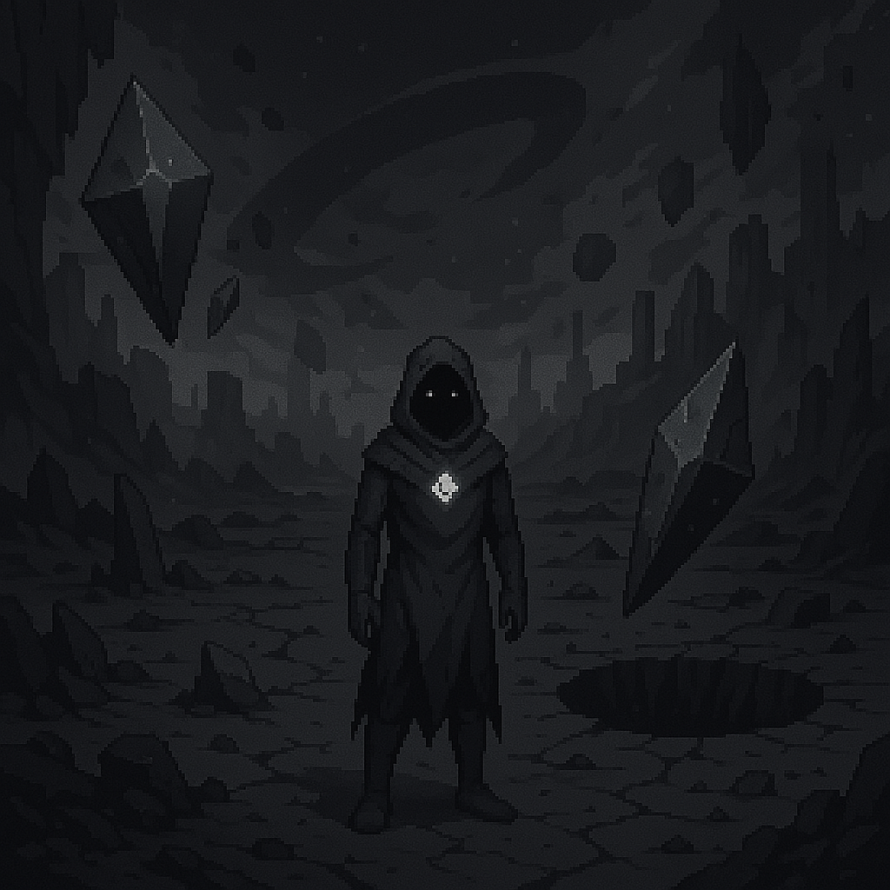

# ⚫ Nullshade – *The Colorless Core*

> [!IMPORTANT] 
> Checkout this [version of nullshade ►](./nullshade-patch.md) to try and patch my confusions...

  <h3>Nullshade</h3>
  
   <i>The broken, colorless core</i> 

## Overview

- **Name:** Nullshade  
- **Biome:** Crater, void ravines, crystal monoliths, floating debris, broken geometry  
- **City:** *Prism Wound* – Crater where the Prismatic Core once stood  
- **Inhabitants:** None (or voidlings, corrupted spirits)  
- **Visuals:** Desaturated, broken color physics, floating prism shards, slow-time zones  
- **Access:** Locked until mid/late-game  
- **Gameplay:** Endgame zone, multidimensional color puzzles, spectral boss fights  
- **Purpose:** Final boss area / moral decision point — where the final decision about color and balance takes place

---

## 🌑 NULLSHADE RUINS

<!-- 

  <h3>Nullshade Ruins</h3>
  
   <i>The Forgotten Womb of the Core</i> 

 -->

**Nullshade Ruins** is the place between realms 
— the aftermath of a war the world forgot.  
It is lifeless but not dead. 
Everything here feels paused, as if time avoids this place.

---

### Environmental Storytelling & Design

> “Where color was first stripped… 
> and where the last breath of the Prism still echoes.”

### Color Palette:
Desaturated grays, broken whites, void-tones.  

Occasionally, glimmers of color flicker unnaturally 
— like light through oil on water — but they fade when approached.  

### Sound Design:
Muffled wind, distant crystalline chimes, reversed echoes, and "silent thunder" 
— the sound of a memory trying to resurface.

---

## Key Visual Features

### Collapsed Monoliths
- Once radiant towers from the Prism Age.
- Now cracked and hollow, leeching any nearby hue into the soil.
- Some still *hum faintly* if touched by The Prismwalker.

### Shatterglass Pools
- Pools of liquid crystal reflecting **memories not your own.**
- Occasionally show glimpses of the world as it was — or as it might be.
- Standing near them causes Prismwalker’s shard to glow faintly.

### Stone Figures / “The Bound”
- Scattered throughout are frozen, featureless statues — some mid-movement, some kneeling.
- They are echoes of those who once tried to contain or reject color entirely.
- Whispering can be heard near them. Occasionally, they move when unseen.

### The Core Wound
- The central crater where the Prism exploded.
- The environment distorts here — angles warp, gravity shifts subtly, and sound falls away completely.
- The Prismwalker awakens here — their body inert, only the shard beating.

---

## Environmental Narrative Themes

### Loss of memory as architecture:
Structures that seem impossible, 
as if they were designed by forgotten physics or logic.

### Identity mirrors:
Scattered fragments show you not as you are, 
but as the world once feared or hoped you’d become.

### Hollow divinity:
Altars to the Core, untouched for centuries, now cracked and empty.

---
