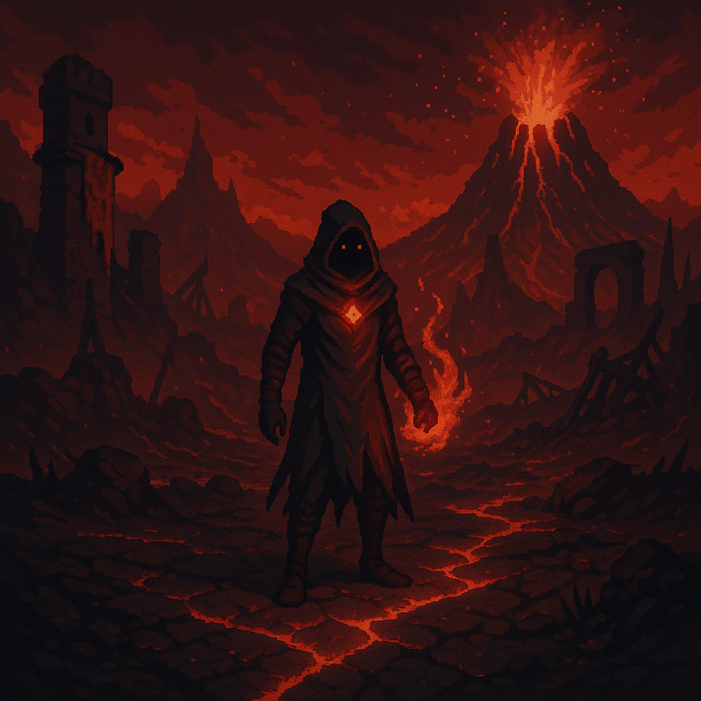

# 🔴 Vireya – *The Ember Expanse (Red)*

  <h3>Vireya</h3>
  
   <i>Ember-forged battlefield zone</i> 

## Overview

- **Name:** Vireya  
- **Biome:** Arid highlands, burnt steppes, shattered battlefields, volcanic fields, battle-scarred plateaus  
- **City:** *Crimson Bastion* – A fortress of red stone built on ancient lava flows  
- **Inhabitants:** Warriors, rebels, fire sorcerers, blood cults  
- **Visuals:** Cracked earth, ancient siege machines, scorched banners  
- **Hazards:** Lava channels, heatstorms, relic ghosts  
- **Gameplay:** Combat-focused; war machines, flame hazards, moral choice  
- **Key Locations:** Crimson Bastion, Duelist’s Pit, Fox Mirage  
- **Key Characters:** Vermilion Duelist, Amaranth the Undying  
- **Artifact Examples:** Alizarin Quilt, Cinnabar Seal  

**Environmental Twist:**  
Heat and light affect your stamina; blood spilled in battle may “wake” old gods or curses.

---

## Crimson Bastion

---
