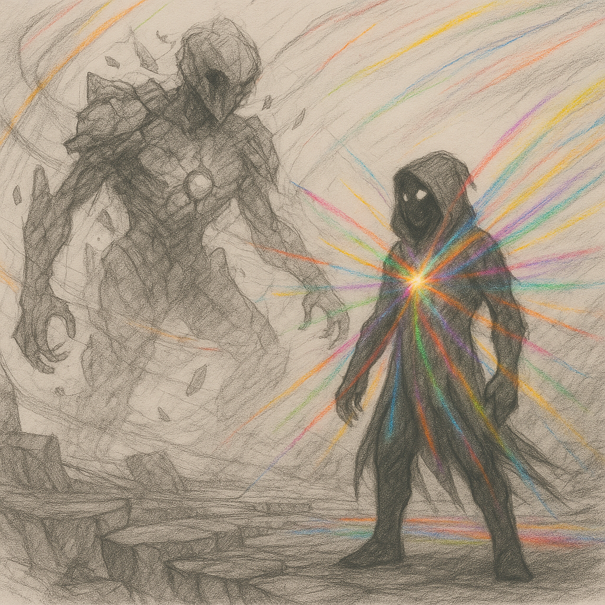
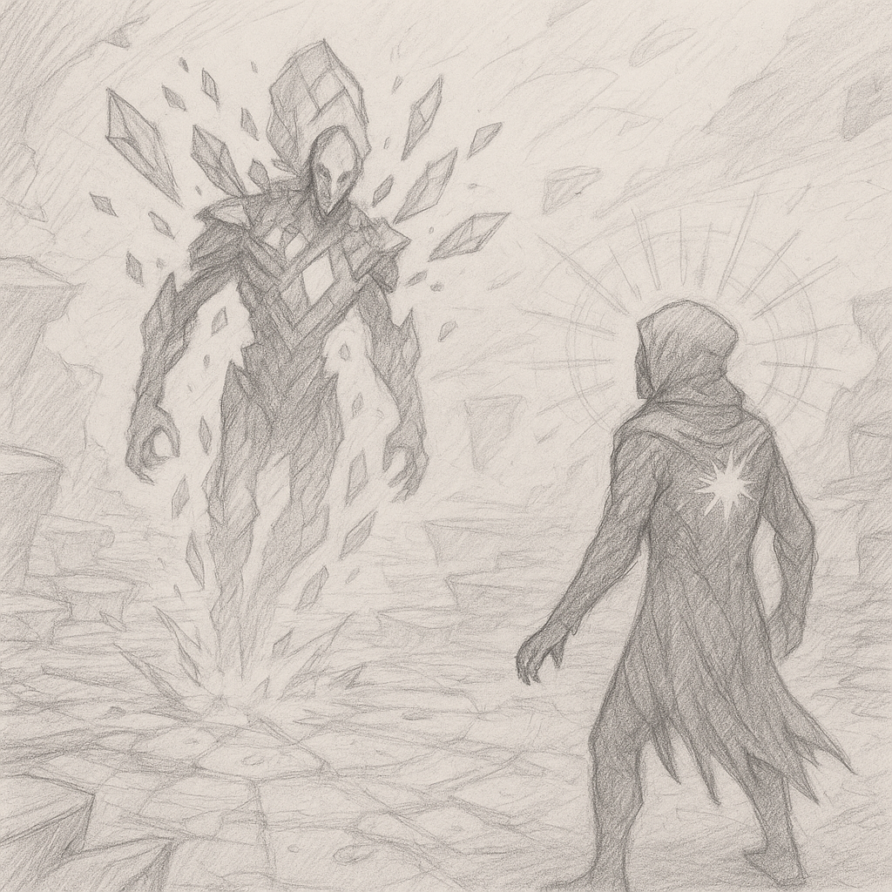

<div align="right">

[◄ Go back to Scenes](./scene-examples.md)

</div>

# Endgame - **BOSS FIGHT: The Fractured Core**

Complete boss fight script for the final encounter in [Nullshade – The Colorless Core](../regions/nullshade.md).

Written with emotional and visual transitions, combat phases, and player dialogue hooks.

<div align="center">
  
  <!--  -->
</div>

| | |
| ------------------ | ----------------------------------------------------------- |
| **Location:**      | Prism Wound (crater at the heart of Nullshade)              |
| **Boss Identity:** | The shattered consciousness of the Prismatic Core,</br>broken into volatile fragments of memory, color, and silence. |
| **Final choice:**  | Do you reforge the Core, or let the world remain fractured? |

---

## **🌑 PRE-FIGHT — Entering the Core**

### **Visuals:**  
The arena is a floating spiral of broken platforms, glowing softly with faded hues.  
Time appears to stutter — echoes of past colors flicker in and out, like forgotten thoughts.

### **Environmental Dialogue (Etched Glyphs):**

```
"They tried to own color. It unmade them."
"Each hue is a mirror. You are what remains."
"Speak no truth unless you can carry its silence."
```

### **Boss Voice (Disembodied):**
> "You carry all hues. That is not balance — that is burden."  
> "I was whole. I was harmony. And then… they pulled."  
> "What are you? A vessel? A verdict?"  

---

## ⚔️ **PHASE I – "SHARD OF MEMORY"**

### **Visual:**  
The boss is a **floating crystal wreathed in dim fragments**.  
Colored shards orbit it violently. Each attack phase mirrors a past Order.

### **Mechanics**:

- **Color Echoes:** 
Arena changes tint — a different hue dominates briefly (e.g., red = high aggression, blue = defensive reflection).

- **Memory Breaks:** 
Boss projects ghostly memories (NPC illusions or past decisions) as obstacles.

### **Boss Lines:**

> "You chose fire once. Did it warm you… or burn the world?"  
> "She begged for mercy. You answered with steel."  
> "Even balance leaves blood beneath it."

### **Transition (at 60% HP):**

The fragments begin **collapsing inward**, forming a vaguely humanoid shape.

> "I remember now… how they screamed as they took me."  
> "Balance is not peace. It is tension. It is war behind a smile."

---

## ⚡ **PHASE II – "VOICE OF THE SHATTERED"**

### **Visual:**  
Boss becomes a **multi-faced spectral figure**, with each mask glowing faintly in different hues.  
Background warps — arena tilts, echoes time loops.

### **Mechanics:**

- **Mask Swap:** 
Each face casts attacks from one hue's magic (e.g., yellow = light burst illusions, purple = illusion clones).

- **Silence Zones:** 
Areas go dark; player can only hear whispers of past choices.

### **Boss Lines:**

> "Will you kill what you could become?"  
> "What is color, but the shape of pain refracted?"  
> "There is no you. Just the colors you failed to resist."

---

## 🌘 **PHASE III – "THE VOID REMEMBERS"**

### **Trigger:** Player gets boss to 10% HP.  
The color fragments **explode outward**, and everything turns **gray** — visual noise fades, music cuts.  
For 10 seconds, the player is alone.

### **Voice (Whispered from Every Direction):**

> "Was it worth it?"  
> "Did you choose, or did they choose through you?"  
> "Do you know your hue now?"

### **Player Choice Moment:**

A crystal forms before you with two options:

- ☀️ **Rebind the Prism** – Attempt to restore harmony and color.

- 🌑 **Let it Fracture** – Embrace entropy and multihue freedom.

> "Shape me again… or scatter me forever."

---

## **🌓 ENDING VARIANTS (Optional Outcomes)**

### **Rebind the Prism:**

- Arena blooms into soft light; a unified prismatic form emerges briefly.

- Colors realign in the world. Some Orders reform. Others resist.

- Player becomes the **new Core** — a symbol of hopeful synthesis.

### **Let it Fracture:**

- Prism shatters fully. Each shard flies outward into different regions.

- The world remains color-divided, but freer, wilder, unpredictable.

- Player vanishes — **a myth** whispered across all hues.

---

## 🌘 **FINAL CHOICE – Dialogue Tree: “What hue remains in you?”**

> *(The arena is shattered. The spectral remnants of the Core float before you.  
> A crystal forms — still, silent. You may speak before your choice is made.)*

---

🟥 **RED-ALIGNED RESPONSE** (Anger, Will, Sacrifice)  
> "Enough balance. The world needs fire."

🗣 *Fractured Core Response:*  
*"And what burns will not bloom. But it will be clean."*

✅ This unlocks: **[Let It Fracture]**

---

🟩 **GREEN-ALIGNED RESPONSE** (Patience, Growth, Harmony)  
> "Even broken things can grow again."

🗣 *Fractured Core Response:*  
*"Then bury me in root and silence — and bloom a new beginning."*

✅ This unlocks: **[Rebind the Prism]**

---

🟦 **BLUE-ALIGNED RESPONSE** (Logic, Doubt, Control)  
> "If I choose wrong, it won’t be the first time."

🗣 *Fractured Core Response:*  
*"Color is error given shape. Will you shape a lie?"*

✅ Branches into either path depending on second choice.

---

🟨 **YELLOW-ALIGNED RESPONSE** (Hope, Wit, Illusion)  
> "What if the trick is that there’s no right answer?"

🗣 *Fractured Core Response:*  
*"Then laugh as it shatters, little fool. Or shine it back into place."*

✅ Branches into either path.

---

🟪 **PURPLE-ALIGNED RESPONSE** (Dream, Identity, Paradox)  
> "Both paths are real — and neither are true."

🗣 *Fractured Core Response:*  
*"Then speak the dream you want to wake in."*

✅ Prompts a **“Speak Your Truth”** option — player types/refines a choice.

---

🟫 **BROWN-ALIGNED RESPONSE** (Endurance, Memory, Truth)  
> "I remember how this started. Let’s finish it right."

🗣 *Fractured Core Response:*  
*"Memory is a grave. Will you plant peace in it… or burn it again?"*

✅ This unlocks: **[Rebind the Prism]**

---

⚫ **NEUTRAL / VOID RESPONSE** (Apathy, Clarity, Finality)  
> "Nothing is left. I choose silence."

🗣 *Fractured Core Response:*  
*"...Then become the silence."*

✅ This unlocks: **[Let It Fracture]**

---

### 🎮 **PLAYER ACTION PROMPT**

> **“What do you do?”**  
> *(Options fade in, based on your dialogue):*

- 🔹 **[Rebind the Prism]**  
  *“Shape the world whole again.”*

- 🔸 **[Let It Fracture]**  
  *“Let the hues stay free — even if it means they drift apart forever.”*
