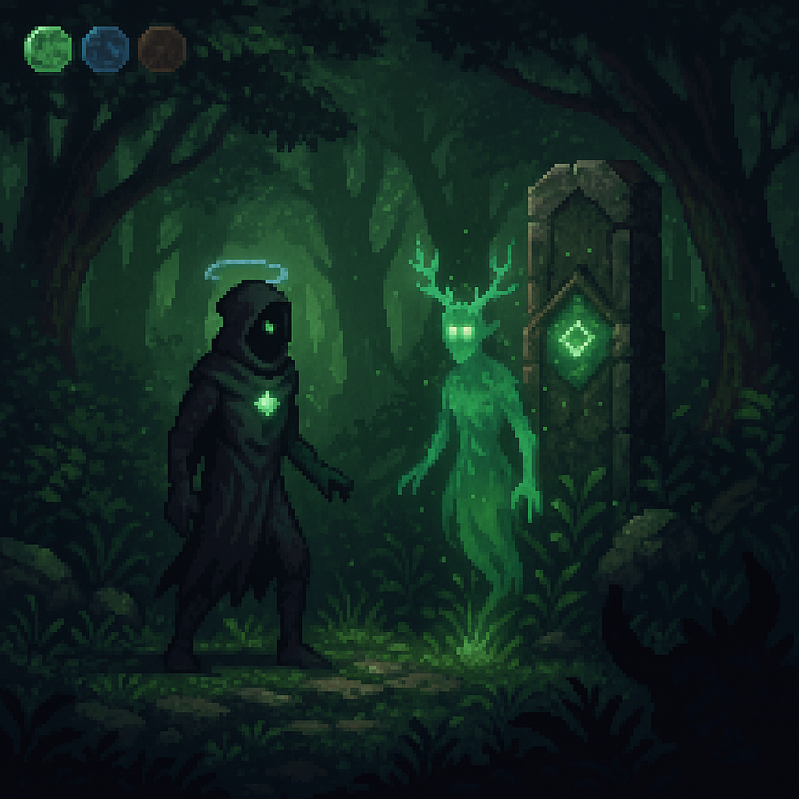
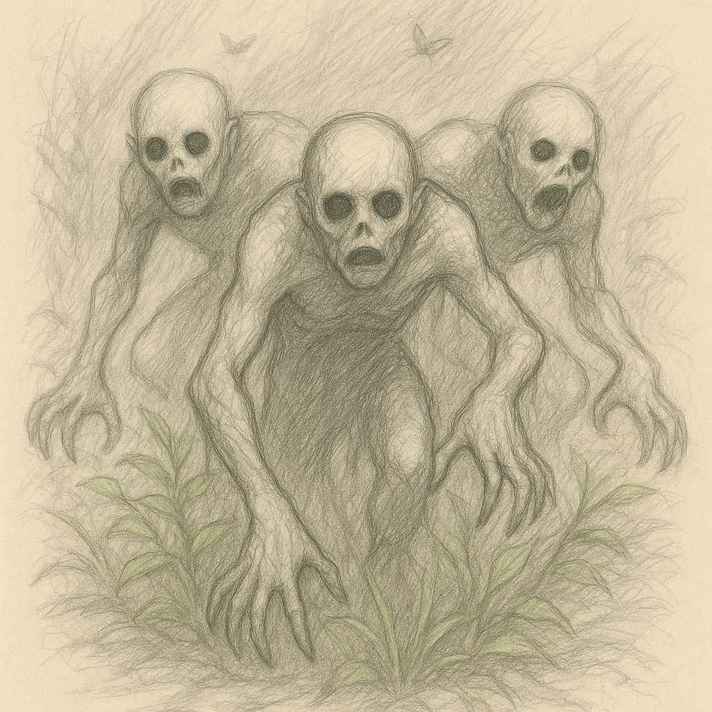

# IN-GAME SCENE: “Whispers Beneath the Greenwood”

**Scene Name**: “Whispers Beneath the Greenwood”  
**Location**: *Emerald Hollow, Verdant Order territory*  
**Visual Style**: 
  - Pixel art with painterly flourishes - deep forest greens with streaks of glowing viridian.
  - Light trickles through giant leaves; faint particles drift like pollen.
  - The environment breathes softly.

**Player Status**: Bound to **Verdant (Green)**, **Cobalt (Blue)**, and **Earthen (Brown)** hues.  

---

## 📷 Scene Opens

### [CAMERA]
Side-scrolling 2.5D. Fog rolls in softly at the edges.  
Trees stretch high with swaying bioluminescent moss.  
In the distance, a ruined shrine pulses with fading green light.  

### [HUD]
- 🌿 Verdant Bound (Active): *Vine Grasp, Photosynthetic Heal*
- 🌊 Cobalt Equipped: *Static Dash, Mind Echo*
- 🪨 Earthen Equipped: *Decay Touch, Memory Echo*

---

## 🎙️ Narration (Internal Monologue / Voice-over)
> “Greenwood does not speak in words.  
> It breathes, it remembers. And it knows I am not its child.”

---

## NPC Encounter
*A translucent figure with green-glowing antlers materializes from the roots and vines...*  

  
   <i>Verdant Ghost - Thalera the Rootborn</i> 

### Thalera:
> “Your feet are bare. Your breath uncolored.  
> You do not belong, Prismwalker.”  
>  
> “Yet… you carry the Root’s grief in your steps.”

### Dialogue Options (Color-Gated):
- 🟩 **[Verdant-Bound]** “The Grove weeps. I’ve come to listen.”
- 🟦 **[Cobalt-Bound]** “Memory stirs here. Show me what was forgotten.”
- 🪨 **[Earthen-Bound]** “Decay is truth. Let me touch what remains.”

---

## 🎮 Environmental Puzzle (Color Mechanic)

Thalera vanishes, revealing three moss-covered obelisks.  
Each is dormant until touched with the right hue.  

### Puzzle Prompt:
> “Only one who speaks with root, rain, and rot may pass.”

- 🟩 Use **Verdant’s Vine Grasp** to awaken the left obelisk (growth).
- 🟦 Use **Cobalt’s Mind Echo** to resonate the middle one (spirit).
- 🪨 Use **Earthen’s Decay Touch** to crumble the right (death).

Solving all three causes a Color Bloom: a shockwave of green light that bleeds across the forest, opening a path forward.

---

## 👹 Ambush Encounter: Null-Touched Beasts
*As you proceed, three [nullborn husks](./enemies/nullborn-husks.md) crawl from the undergrowth...*

  
   <i>Nullborn husks; Twitching creatures with void-filled eyes</i> 

### Combat Cue:
Music shifts to an offbeat rhythm. 
The creatures **distort your hue UI**, forcing quick **Chromatic Shifts** to adapt.
  - Use Cobalt’s **Static Dash** to evade.
  - Use Verdant’s **Heal** mid-combat by rooting in place.
  - Optional: Switch to Crimson (if unlocked) mid-fight to burn the husks.

---

## 🧠 Memory Echo (Lore Discovery)

After the battle, you step into a glade where the air shimmers.  
Activating a stone with **Earthen Bound** plays a fragmented memory:  
> *A young Verdant sage pleading with a Tyrian emissary...*  
> “If you twist color to rule, you will unmake the world.”  
> The emissary smiles: “That’s the idea.”

Unlocks: **Hue Archive Entry: “The Tyrian Accord Betrayal”**

---

## 🚪 Scene Exit: Verdant Shrine Door

Only opens once the **player soul is tinted green enough** - 
measured by absorbed fragments, dialogue choices, and combat outcomes.  

If not green enough:  
> *“The forest sees through lies. Come back when you’ve bled chlorophyll.”*

---
